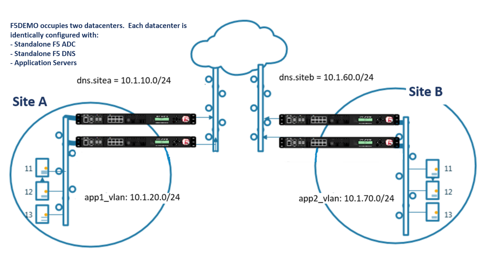

Class 3 - Data Center Availability Services Using BIG-IP DNS
============================================================

* Students will configure F5 DNS servers to support GSLB (Global Services Load Balancing) on a single device in site1.
* Join an additional F5 DNS server in site2 to the GSLB cluster.
* An Internal group of DNS servers is authoritative for the zone example.com and contains a static A record for "www.example.com", which resolves to 203.0.113.9.
* Students will add glue records and delegate gslb.example.com to the F5 GSLB DNS servers.
* Convert the A record "www.example.com" to be a CNAME record pointing to *www.gslb.example.com*.
* Students will create an additional GSLB service using iControl REST
* Modify the DNS load balancing method from active/active to active/standby

By the end of the lab students will have configured F5 GSLB DNS servers to alternately resolve www.example.com to 203.0.113.9 and 198.51.100.41. At the end of the lab, students will then have an opportunity to simulate a real-life failure scenario and observe how BIG-IP DNS responds to mitigate the service outage.

.. toctree::
   :glob:

   module1/intro.rst
   module1/lab*/lab*

