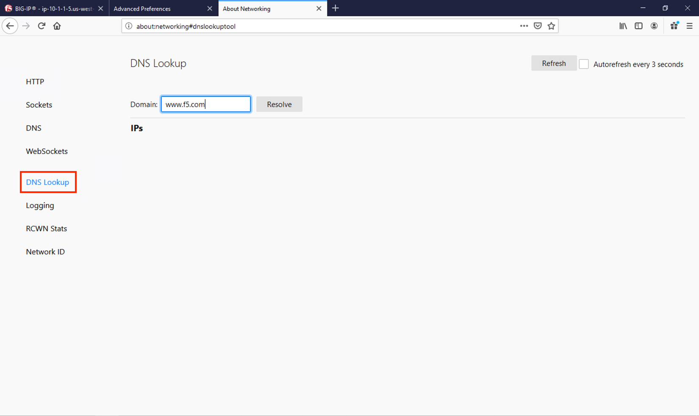
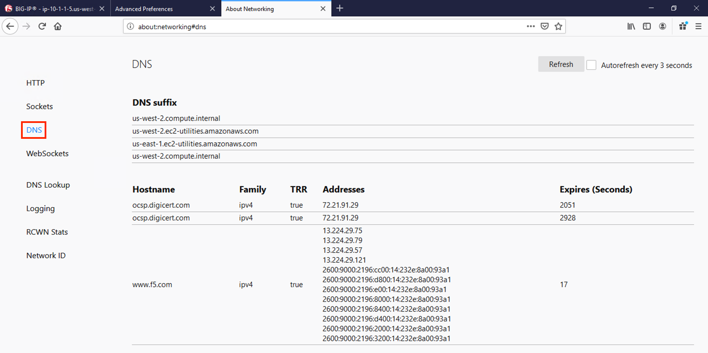
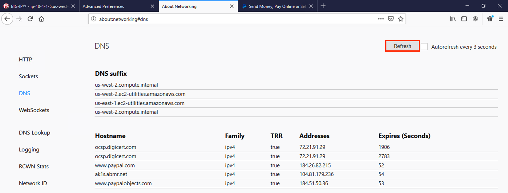
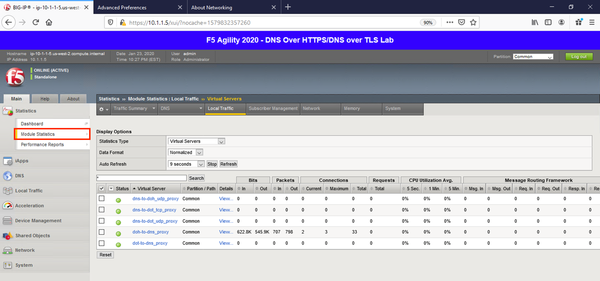
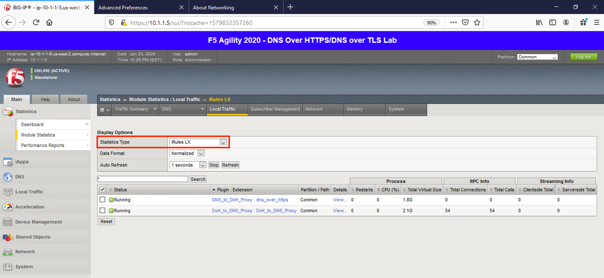
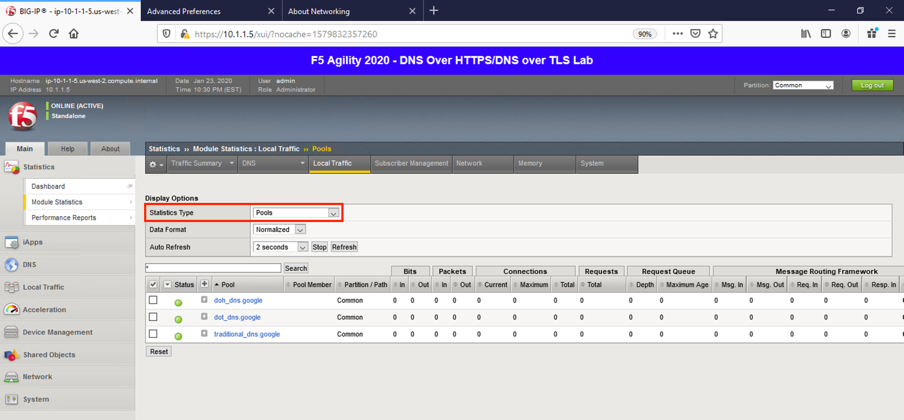
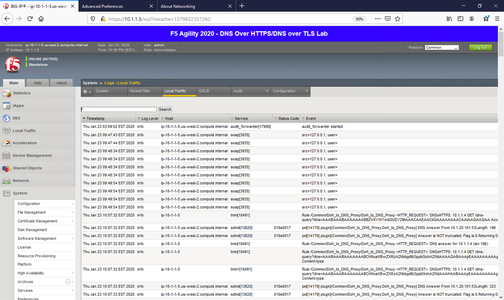
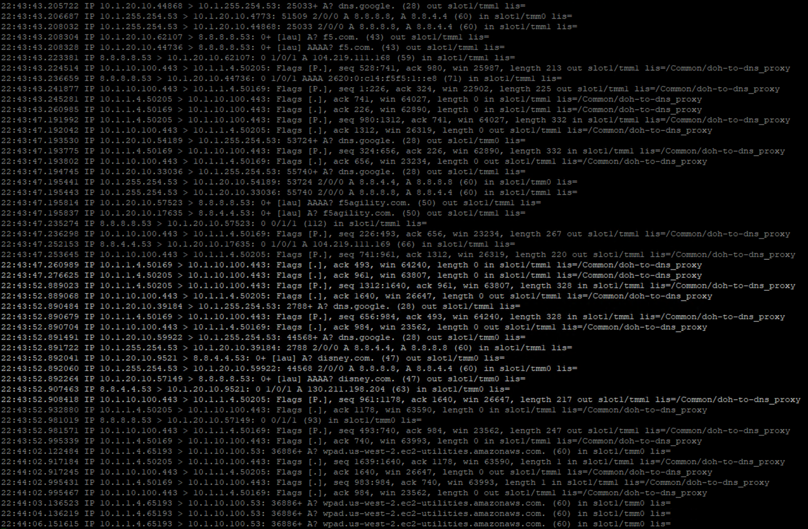

Proxying DNS over HTTPS Queries to Traditional DNS 
--------------------------------------------------

Certificate Requirements for DoH/DoT Virtual Servers
~~~~~~~~~~~~~~~~~~~~~~~~~~~~~~~~~~~~~~~~~~~~~~~~~~~~

:NOTICE: DNS over HTTPS requires a valid server-side certificate. In our lab, we created a self-signed CA certificate as well as a self-signed certificate for the server. We loaded those certificates in your Firefox browser so that the browser will trust the BIG-IP DoH resolver.

In a real-world scenario, you would need a certificate signed by a
well-known certificate authority and loaded into the BIG-IP and attached
to the client-ssl profile in use for DoH/DoT listeners. Most DoH
clients, including Firefox, will not trust a DoH server if the
certificate is not signed by a known certificate authority.

Test Driving DNS over HTTPS to Traditional DNS
~~~~~~~~~~~~~~~~~~~~~~~~~~~~~~~~~~~~~~~~~~~~~~

Now, let’s generate some traffic and see the translations in real-time.

Firefox Configuration
~~~~~~~~~~~~~~~~~~~~~

For this test, we’re going to use Firefox as our DoH client. Click the
second tab in Firefox to view the about:config page. On the top of that
page, you’ll see a search box. Enter *trr* and press enter to see the
DoH (trusted recursive resolver) configuration.

|image17.png|

We’ve pre-configured a few things for you. First, we set
*network.trr.uri* to our custom virtual server URL. We also enabled
*network.trr.useGET* as it’s a bit faster than using POST, but you’re
welcome to test using POST as well. We set *network.trr.mode* to 3,
which means we want Firefox to **only** use DoH. This will not be a
typical configuration as Firefox defaults to traditional DNS when a DoH
request fails. That explains the differing timeout values just below
that setting. The *network.dns.skipTRR-when-parental-control-enabled*
disables Firefox’s feature that disables DoH when parental control via
DNS is sensed on the network.

**Please keep in mind that these settings are changing as Firefox
continues testing DoH. The ink on the RFC is still wet, technically, and
those heavily involved in encrypted DNS are still working out the
nuances.**

Firefox Network Utilities
~~~~~~~~~~~~~~~~~~~~~~~~~

Clicking on the third tab in Firefox will open the networking tools page
within the browser. This is a great way to see if DoH (TRR in
Mozilla-speak) is working. Click on *DNS Lookup* to bring up the DNS
query tool.

|image18.png|

Entering a URL and clicking *Resolve* will show the A/AAAA records
returned for that FQDN.

|image19.png|

If you then click on *DNS*, you’ll be presented with a table of the
current in-browser DNS cache. Click on *Refresh* to update the view. You
can see in the output below that TRR was *true* for the queries sent,
meaning DoH was used to resolve those hostnames.

|image20.png|

DoH in Action
~~~~~~~~~~~~~

Open a new tab and browse to a website. Return to the third tab and
click *Refresh* to see the updated DNS cache table.

|image21.png|

BIG-IP Statistics and Logging
~~~~~~~~~~~~~~~~~~~~~~~~~~~~~

Back in the first tab on the F5 web UI, navigate to **Statistics** ->
**Module Statistics** -> **Local Traffic**. Make sure that *Virtual
Servers* is selected in the *Statistics Type* drop-down. Observe the
traffic statistics on the DoH-to-DNS virtual server.

|image22.png|

Change the *Statistics Type* to iRulesLX and you can see how many RPC
connections have been made.

|image23.png|

Change the drop-down to *Pools*. You should notice that the back-end
pools show 0 connections. Why? Because iRulesLX is talking to the
back-end DoH resolvers directly. You could point your DoH iRule to a
local VIP with a DNS pool for better performance, stability, etc. but
that is outside the scope of this lab.

|image24.png|

Navigate to **System** -> **Logs** -> **Local Traffic**. Notice that
some useful information is being logged to help show the parsing and
querying that is taking place behind the scenes.

|image25.png|

Capturing DNS over HTTPS Queries to Traditional DNS Traffic
~~~~~~~~~~~~~~~~~~~~~~~~~~~~~~~~~~~~~~~~~~~~~~~~~~~~~~~~~~~

Finally, minimize *Firefox* to reveal the CLI shortcuts on the desktop:

|image26.png|

Let’s open the BIG-IP DNS Proxy link to bring up the BIG-IP’s CLI. Once
running, let’s start a capture that will show us both sides of the DoH
proxy:

``tcpdump -nni 0.0 (host 10.1.1.4 and host 10.1.10.100 and port 443) or (host 8.8.4.4 or host 8.8.8.8 and port 53)``

Once running, maximize *Firefox* and perform another DNS lookup. View
the HTTPS and DNS traffic in the packet capture output. The output below
shows my queries to f5.com, f5agility.com and disney.com.

|image27.png|

Stop your capture before moving to the next section. This concludes the
DoH-to-DNS proxy portion of the lab.

.. |image17.png| image:: _images/image17.png
   :width: 7.5in
   :height: 4.47917in

.. |image19.png| image:: _images/image19.png
   :width: 7.5in
   :height: 3.19271in

.. |image26.png| image:: _images/image26.png
   :width: 2.75in
   :height: 6.40278in

