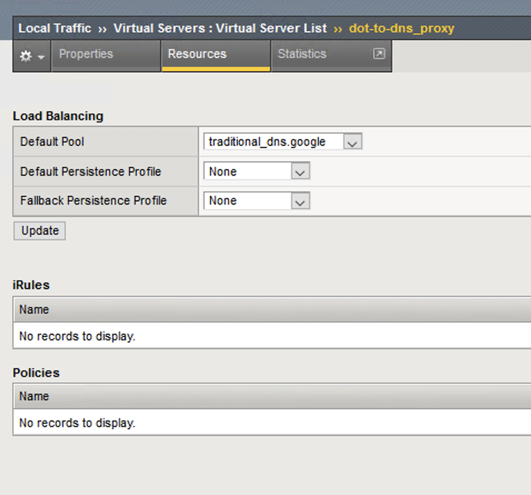
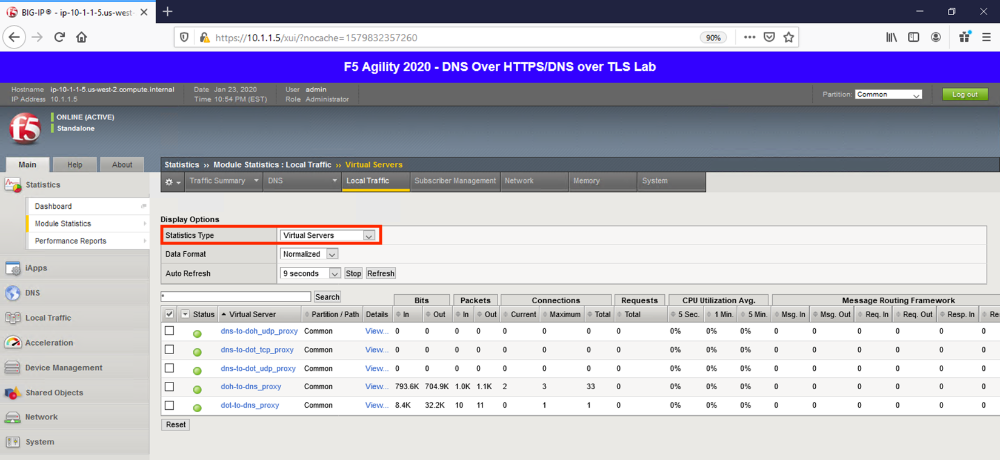
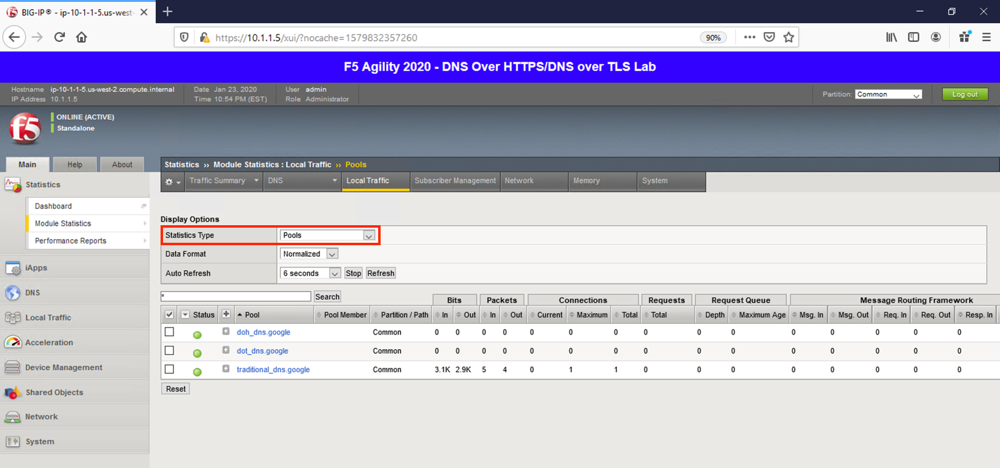
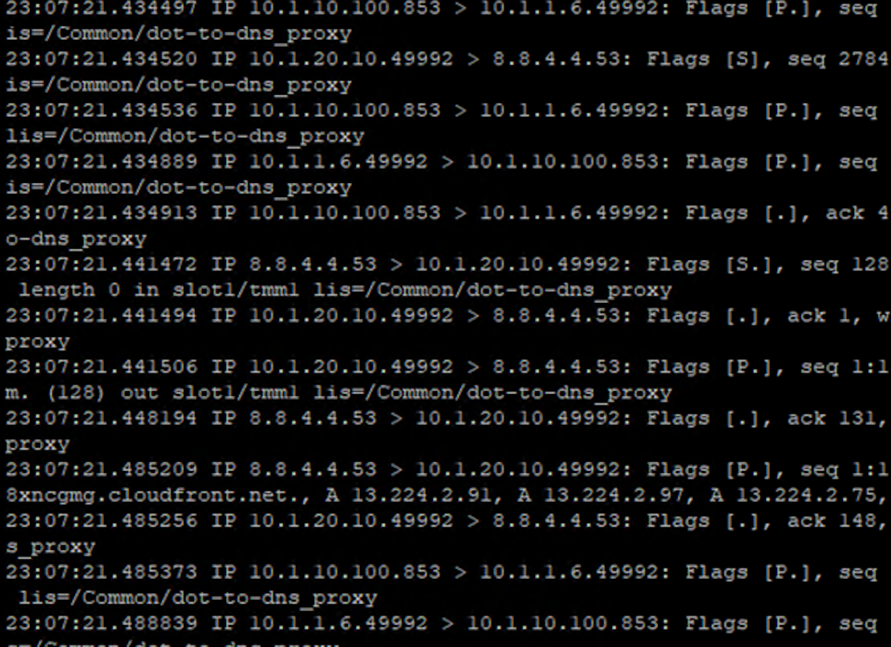

Proxying DNS over TLS Queries to Traditional DNS
------------------------------------------------

DoT-to-DNS is a bit more simplistic. We’re simply taking the existing
DNS request and encapsulating it in TLS. If you review the virtual
server configuration, you’ll notice that we’re simply using a client-SSL
profile and a backend pool. No iRule magic needed here; just classic
BIG-IP high-performance SSL offloading.

**The client-SSL profile on this virtual server specifies that SSL/TLS
termination should occur on the client side of the connection.**

Virtual Server Configuration
~~~~~~~~~~~~~~~~~~~~~~~~~~~~

Maximize *Firefox*. Notice the virtual server for DoT-to-DNS is very
simple:

|image28.png|

Clicking on **Resources** tab on the top navigation bar will show that the
virtual server has a simple pool and no iRules attached.

|image29.png|

Test Driving DNS over TLS to Traditional DNS
~~~~~~~~~~~~~~~~~~~~~~~~~~~~~~~~~~~~~~~~~~~~

Let’s return to the desktop and launch the Lab DNS Server client. You’ll
be automagically logged in. Let’s run a DNS over TLS query:

``kdig +tls @10.1.10.100 www.f5.com``

|image30.png|

Viewing Statistics for DoT-to-DNS
~~~~~~~~~~~~~~~~~~~~~~~~~~~~~~~~~

You can then see statistics on the virtual server by navigating to
**Statistics** -> **Module Statistics** -> **Local Traffic** and
selecting *Virtual Servers* in the drop-down list.

|image31.png|

Because this virtual server is taking advantage of backend pools, you
will see statistics under the *Pools* statistics type as well.

|image32.png|

Because we don’t have any type of logging configured for that virtual
server, you won’t see any information in **System** -> **Logs** for this
traffic. Conventional F5 logging/statistics practices can be used for
these connections, so we’ll move on.

Capturing DNS over TLS to Traditional DNS Traffic
~~~~~~~~~~~~~~~~~~~~~~~~~~~~~~~~~~~~~~~~~~~~~~~~~

Maximize the BIG-IP CLI window. Execute the follow tcpdump command:

``tcpdump -nni 0.0 port 53 or port 853``

Return to the Ubuntu Jump Host and re-run your **kdig** command. Observe
the front and back-end connections using port 853 and 53, respectively.

|image33.png|

Stop your capture before moving on to the next section. This concludes
the DoT-to-DNS portion of the lab.

.. |image28.png| image:: _images/image28.png
   :width: 7.5in
   :height: 10in

.. |image30.png| image:: _images/image30.png
   :width: 7.5in
   :height: 4.76136in

