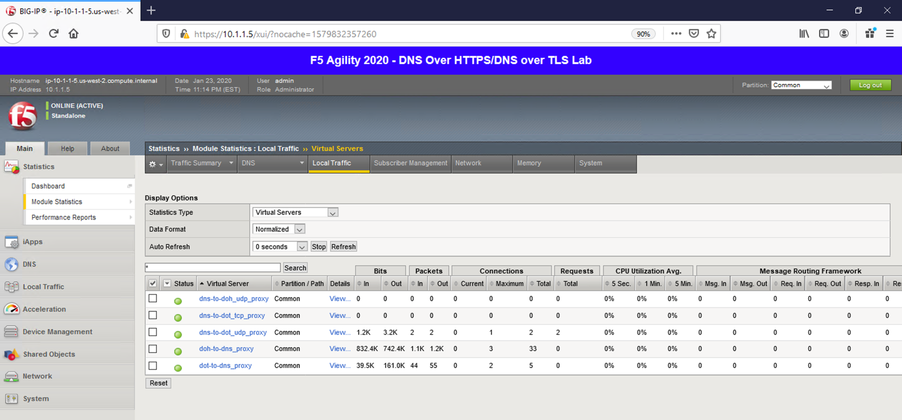

Proxying Traditional DNS to DNS over TLS
----------------------------------------

In this section of the lab, we’re going to run DoT in the opposite
direction, taking traditional DNS requests and translating them into DoT
requests. This is done as simply as the DoT-to-DNS; we simply take the
incoming DNS connection (UDP or TCP) and encapsulate it in TLS using a
server-side SSL profile.

Test Driving Traditional DNS to DNS over TLS
~~~~~~~~~~~~~~~~~~~~~~~~~~~~~~~~~~~~~~~~~~~~

On the Ubuntu jump host, issue the following command:

``kdig @10.1.10.101 www.yahoo.com``

You should receive a successful response as shown below:

|image34.png|

Viewing Statistics for DNS-to-DoT
~~~~~~~~~~~~~~~~~~~~~~~~~~~~~~~~~

Back in the BIG-IP web UI, you will see that the VIP is receiving
connections:

|image35.png|

Issuing the same command with TCP will increment the counters on the
corresponding virtual server:

``kdig +tcp @10.1.10.101 www.f5.com``

|image36.png|

Again, nothing super-fancy is happening in this configuration.
Conventional F5 logging methods can be used for this traffic so we won’t
cover that in this lab.

Capturing Traditional DNS to DNS over TLS Traffic
~~~~~~~~~~~~~~~~~~~~~~~~~~~~~~~~~~~~~~~~~~~~~~~~~

We can see the 53/853 exchange on a packet capture using the same
**tcpdump** command we used in the DoT-to-DNS section, as the IP/ports
are simply being switched around:

``tcpdump -nni 0.0 (host 10.1.20.10 or 10.1.1.6) and (port 53 or port 853)``

You will see the 53 and 853 connections in the output, as shown below.

|image37.png|

Stop your capture before moving on to the next section. This concludes
the DNS-to-DoT section.

.. |image34.png| image:: _images/image34.png

.. |image36.png| image:: _images/image36.png
.. |image37.png| image:: _images/image37.png
