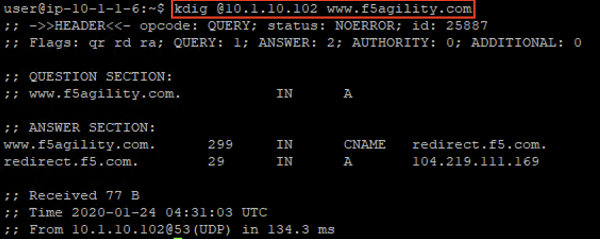
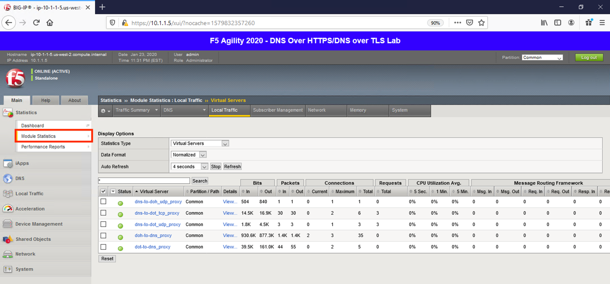
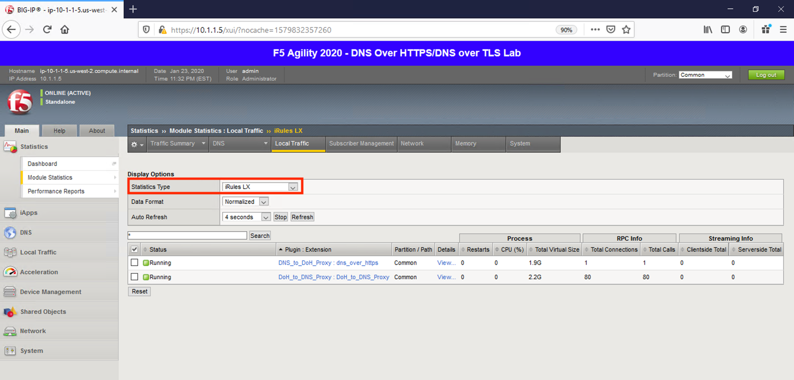
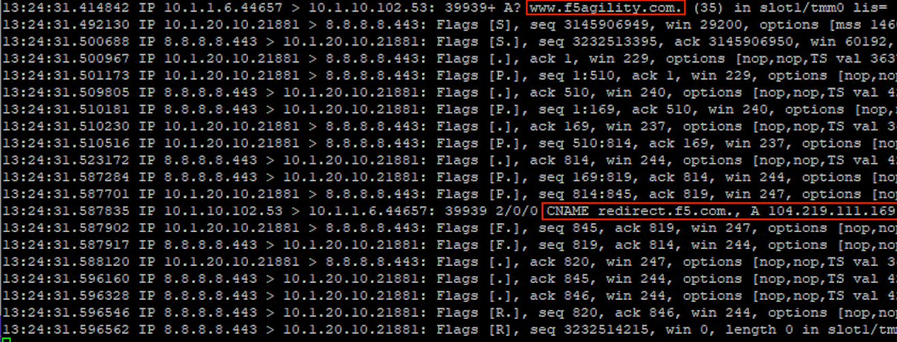

Proxying Traditional DNS queries to DNS over HTTPS
--------------------------------------------------

Finally, let’s look at converting a DNS query to a DoH request.

Test Driving Traditional DNS to DNS over HTTPS
~~~~~~~~~~~~~~~~~~~~~~~~~~~~~~~~~~~~~~~~~~~~~~

Minimize Firefox and bring both CLI session windows up. On the Lab DNS Server, once again use **kdig** to simply generate a traditional DNS request. Notice that this section of the lab uses a different VIP, the 10.1.10.102 address.

``kdig @10.1.10.102 www.f5agility.com``

You’ll get a response as shown below:

|image38.png|

Viewing Statistics for DNS-to-DoH
~~~~~~~~~~~~~~~~~~~~~~~~~~~~~~~~~

Back on the BIG-IP, we’ll see connections on the DNS-to-DoH virtual server in the Local Traffic module statistics:

|image39.png|

If we set the statistics type to *iRulesLX*, we’ll see RPC connections on the iRule for this translation:

|image40.png|

Capturing Traditional DNS to DNS over HTTPS Traffic
~~~~~~~~~~~~~~~~~~~~~~~~~~~~~~~~~~~~~~~~~~~~~~~~~~~

Running a packet capture on the BIG-IP DNS Proxy, we can view the front-end udp/53 requests being translated to DoH requests:

``tcpdump -nni 0.0 (host 10.1.10.102 and port 53) or (host 8.8.4.4 or host 8.8.8.8 and port 443)``

Run **kdig** queries on the Lab DNS Server to generate traffic.

:NOTICE: If your packet capture is “noisy,” remember that you're also capturing the HTTPS monitor traffic as the “doh_google.dns” pool performing regular queries.

Notice that a port 53 request comes in, a HTTPS connection is set up and the query is passed, then the port 53 response is sent to the client before the HTTPS connection is torn down.

|image41.png|

This concludes the hands-on portion of the lab.

