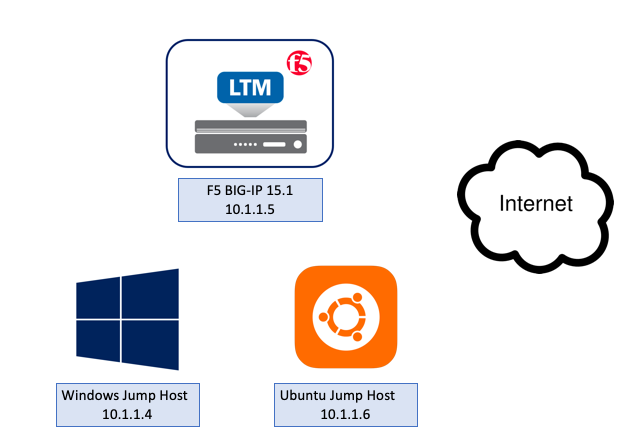

Topology
~~~~~~~~

This lab consists of a single BIG-IP that is proxying the various DNS
packet types. A single Windows jump host sits in the client segment
while an Ubuntu jump server sits in the server segment.

|image1.png|

