LAB: F5 DNS Cloud Service & F5 DNS Load Balancer Cloud Service   
==============================================================

.. contents:: Table of Contents 

Introduction 
############

Welcome to the F5 Cloud Services lab that covers DNS and DNS Load Balancer services. This lab will take you through the setting up, configuration, updates, and removal of the F5 Cloud Services that provide DNS capabilities. You will be using both browser-based UI of the F5 Cloud Services platform, as well as the declarative API, which is available to do all of the things the UI does, and more! 

In the process of this lab you will learn how to:

- Set up a DDoS-protected secondary DNS service

- Retrieve and review the zone file retrieved from the primary DNS (we will provide you with a primary DNS and a zone just for you!)

- Set up Anycast network-backed load balanced DNS record 

- Add and update application endpoints and a load-balancer pool 

- Configure, update, and test geoproximity rules, and

- Have fun working with UI and APIs!

Pre-Requisites
###############################

- Any modern browser: for working with the UI (and this document)
- Postman: for working with the API of the F5 Cloud Services
- Opera browser: for simulating geo-location specific traffic
- Any text editor: for duplicating Load Balanced Record 

**IMPORTANT NOTE**: If you originally signed up for F5 Cloud Services through a Limited User invitation (such as an email invite from another lab or from a different account owner), then it is possible that you haven't yet completed a full registration. 

You can quickly tell if you have a full account by looking at your account(s) in the `F5 Cloud Services Portal <https://portal.cloudservices.f5.com/>`_. If you do now see any "Accounts you own:" and only see "Accounts you've been granted access to" as a **"Limited User"**, then you will need to create a full account / update user info before you can proceed with this lab. You can do so in the step 4(c) below via the F5 Cloud Services API using the Postman request titled "Set User Info (optional)", the details of which are outlined below after the Login. 

Lab Environment Overview
###############################

1. APIs and Services 
*********************

This Lab utilizes standard *F5 Cloud Services API*, as well as a *Lab Service API*, which was custom-built just for executing this lab: 

* **F5 Cloud Services API**: create, use, and remove the services in the scope of this lab 

* **Lab service API**: facilitates auxiliary functions for the lab only: creating DNS entries, sending targeted requests & traffic to the apps/services, etc.  

The following diagram captures the core components of this Lab: 

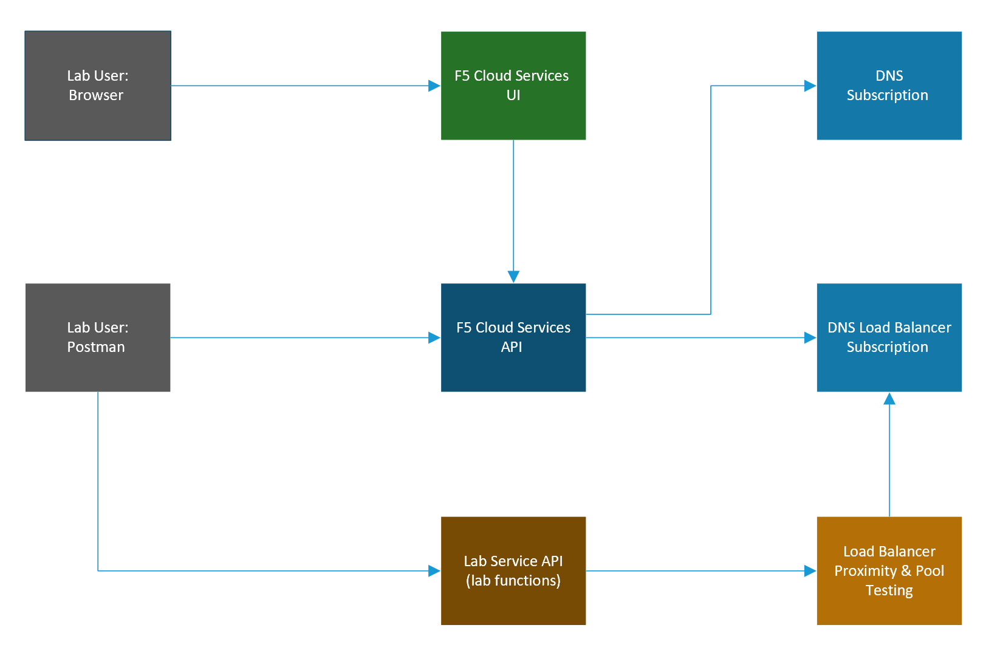
     

2. Application Scenario 
***********************

In order to fully explore the capabilities of F5 Cloud Services, you will be able to use an existing application with a set of live instances across different clouds and geographic locations. This app is `"BuyTime Auction" <http://bit.ly/37fVwfX>`_, a fictitious multi-instance deployment that helps to simulate a globally deployed app topology. Unsurprisingly, performance, global availability, zero downtime, 
and security are critical for this application, while the app Developers & DevOps are used to consuming app infrastructure as-a-Service.  

The following are the demo application instances, some of which will be utilized in the scope of this lab:

.. csv-table::    
   :header: "Name", "Geography", "Cloud/Region", "IP", "URI"

   "NA1", "North America", "AWS - US East (N. Virginia)", "34.229.48.248", "http://na1-auction.cloudservicesdemo.net/"
   "NA2", "North America", "AWS – US East (N. Virginia)", "318.232.64.254", "http://na2-auction.cloudservicesdemo.net/"
   "NA3", "North America", "Azure – US East", "13.82.106.211", "http://na3-auction.cloudservicesdemo.net/"
   "EU", "Europe", "AWS – Europe (Frankfurt)", "3.122.191.227", "http://eu-auction.cloudservicesdemo.net/"
 

The following diagram is a simplified architecture of the Auction application: 

 
.. figure:: _figures/Auction.png

Lab Environment Setup / Validation
##################################

1. F5 Cloud Services Portal
***************************

`a)` Login  

In order to use F5 Cloud Services, you need to be logged in with a valid user account. If you need to sign up, or if you already have one, proceed to the `F5 Cloud Services portal <http://bit.ly/f5csreg>`_. 

.. figure:: _figures/1.png 

Once you've logged in with an account, you will be using the user name and password values in the lab to authenticate with the F5 Cloud Services and the API.

`b)` Subscribe to Catalogs  

In order to access specific F5 Cloud Services, you need to subscribe to the corresponding service catalogs.

   `1.` Click on the **Your F5 Cloud** tab in the left navigation panel and you will see the available service catalogs, as well as the services you have subscribed to, if any. For this lab you will need to click **Subscribe** to **DNS** and **DNS Load Balancer** services.  

   .. figure:: _figures/2.png 

   `2.` For the purposes of the lab you can utilize the Free Tier for both the DNS and DNS Load Balancer services. **NOTE**: you will be asked to add your payment card even for the free tier, however you will not be charged if you follow the Free Tier guidelines outlined here:

   - `F5 DNS Cloud Service Pricing <https://clouddocs.f5.com/cloud-services/latest/f5-cloud-services-DNS-Pricing.html>`_
   - `F5 DNS Load Balancer Service Pricing <https://clouddocs.f5.com/cloud-services/latest/f5-cloud-services-GSLB-Pricing.html>`_

   Should you decide to add additional zones or LBR records beyond the Free Tier, you will only pay for what you use.

   You may also choose to not use a credit card, and instead subscribe through **AWS Marketplace**.

   - `AWS Marketplace: F5 DNS Cloud Service <https://aws.amazon.com/marketplace/pp/B07NKSRQ99>`_
   - `AWS Marketplace: F5 DNS Load Balancer Service <https://aws.amazon.com/marketplace/pp/B07W3P8HM4>`_
   

   .. figure:: _figures/33.jpg 
   
   Add payment card to pay by credit card:
   
   .. figure:: _figures/200.jpg 
      
   Or initiate the subscription from AWS Marketplace to subscribe through it:
      
   .. figure:: _figures/202.jpg 

   After successfully subscribing, your services will appear in the **Your F5 Cloud** tab. You will also see their current status.  

   .. figure:: _figures/4.png 

   If you need to check your payment information, it is available in the **Accounts** tab, **Payment** section.  

   .. figure:: _figures/5.png 

2. Opera with VPN to Test Geo Services 
**************************************

You will need the Opera browser to test proximity rules we will set later. 

Open the Opera browser, click **Settings**,  **Advanced**, **Features** and then **Enable VPN**.   

.. figure:: _figures/7.png 

3. Postman Configuration  
************************

`a)` Download Postman `here <http://bit.ly/309wSLl>`_, open it, create a Postman account if you don’t have one and choose to do so, and sign in. 

`b)` Clone or download and extract the repository

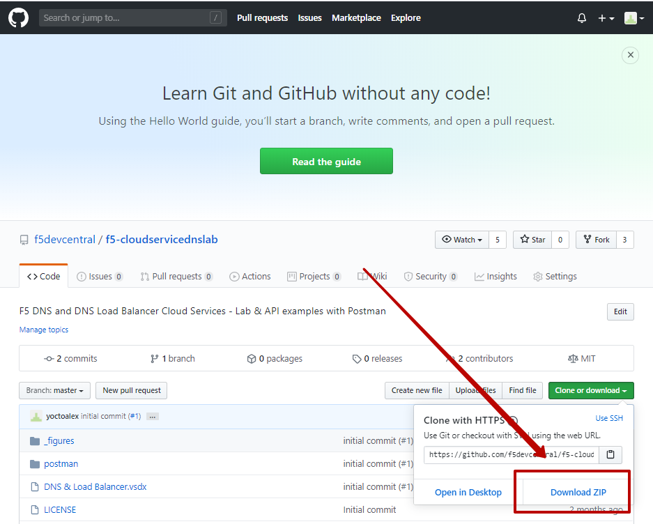

`c)` Import collection – **/postman/F5 Cloud Services DNS LAB.postman_collection.json** and environment – **/postman/F5 Cloud Services DNS LAB.postman_environment.json**.

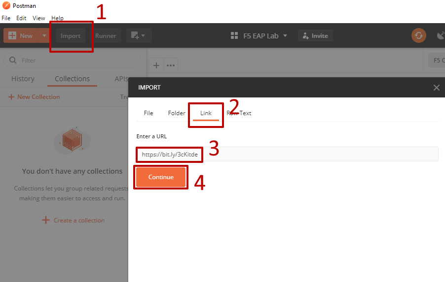

You will now see the imported collection (left side) with the calls that you will be utilizing grouped into several categories, as well as the environment variables (top right) used to store and pass data between Postman and the API.     

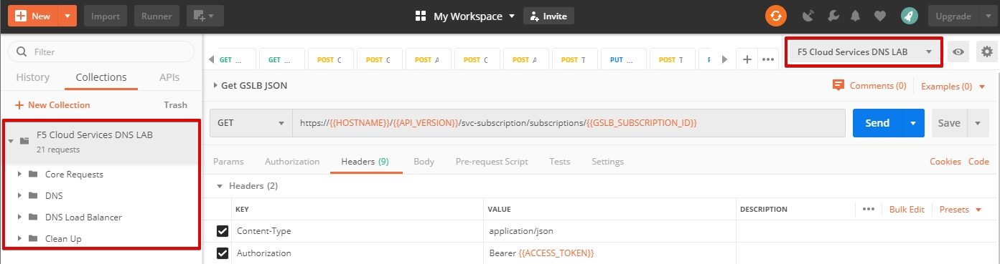

You are now ready to interface with the F5 Cloud Services using Postman. 

4. Zone Name 
*************

In order to create secondary DNS zone in the F5 Cloud Services portal, you need to have a zone name. Use Postman and follow the steps below to get the Zone name from the Lab service API.    

`a)` Open the “F5 Cloud Services DNS LAB” environment variables by clicking the “Environment Quick Look”, click into the field of the corresponding variable, and type the value of user email in the variable “USER_EMAIL” (click **Enter** after typing the values). 

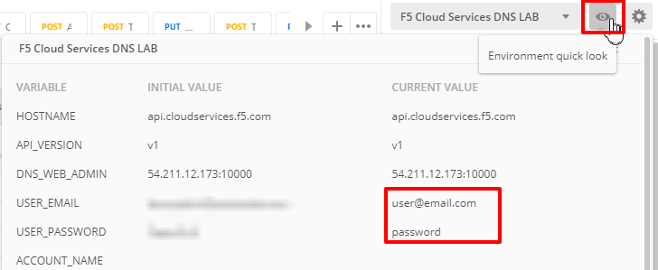

Repeat the same for the “USER_PASSWORD”. 

`b)` Select the **Login** request in the sidebar to login to your F5 Cloud Services profile and click **Send** to get the authorization token. More detailed information on this API request can be found `here <http://bit.ly/36ffsyy>`_. 

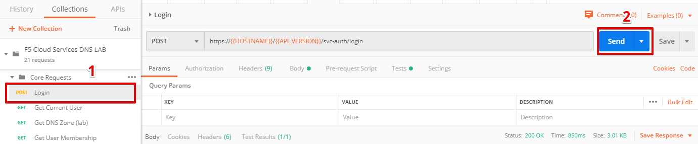

A successful login will result in Postman returning the tokens from the API, shown in the response body below: 

.. figure:: _figures/84.jpg 

These tokens are then stored for subsequent calls using a function inside Postman to set environment variables. You can see the test function in the **Tests** tab: 

.. figure:: _figures/9.jpg 

**NOTE**: If any of the subsequent Postman calls return a blank response or **"status": "unauthorized"** response (see the screenshot below), it means your user token has expired and you will need to re-login. To do that you just need to re-send the **Login** request. 

.. figure:: _figures/10.jpg 

`c)` OPTIONAL: Set User ID & Account Info

**IMPORTANT NOTE**: If you originally signed up for F5 Cloud Services through a Limited User invitation (such as an email invite from another lab or from a different account owner), then it is possible that you haven't yet completed a full registration. You can quickly tell if you have by looking at your account(s) in the `F5 Cloud Services Portal <https://portal.cloudservices.f5.com/>`_ If you do now see any "Accounts you own:" and only see "Accounts you've been granted access to" as a **"Limited User"**, then you need to create a full account & update user info before you can proceed with this lab.

You can do this by running the following **Set User Info** API call, after you've updated the Body of the request with your own organization & address information:

.. figure:: _figures/118.jpg

The response returns the following detail, including your own organization account ID (id):

.. figure:: _figures/119.jpg

More information on this API request can be found `here <https://portal.cloudservices.f5.com/docs#operation/CreateAccount>`_.

At this point you should be a full user with an "Owned Account" and a primary organization account id, which can also be confirmed in the `F5 Cloud Services Portal <https://portal.cloudservices.f5.com/>`_ in the drop-down under your user name (top right), where you should see "Accounts you own:" and the Organization Account you created with **"Owner"** defined.

`d)` Retrieve User ID & Account ID 

Select the **Get Current User** request and click **Send** to retrieve User ID and Account ID to be used in the further requests. 

.. figure:: _figures/86.jpg 

The response returns the following detail: 

.. figure:: _figures/12.jpg 

The retrieved User ID and Account ID are then stored for subsequent calls. 

.. figure:: _figures/11.jpg 

More detailed information on this API request can be found `here <http://bit.ly/37hyQw3>`_. 

`e)` Let’s now retrieve DNS Zone Name with the **Get DNS Zone (lab)** API call. Click **Send**. This call will pass your “ACCESS_TOKEN” in the header of the request to the Labs API in order to validate existence of your F5 account & return back a Zone name unique to your lab. 

Request: 

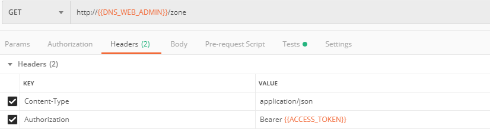

The response will return your test DNS zone name and the status. 

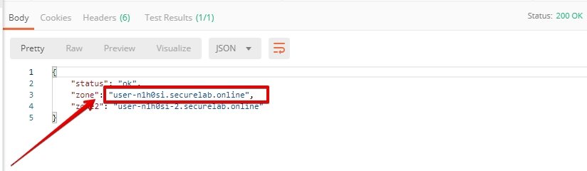

Sending this request will automatically capture of the Zone variables: 

.. figure:: _figures/26.jpg 

This Zone Name will be used for creating Secondary DNS Zone in the F5 Cloud Services portal, as well as throughout the lab as the domain name for your test applications. 

F5 DNS Cloud Service - UI
################

1. Create Secondary DNS Zone
****************************

Let’s now return to the F5 Cloud Services portal and create Secondary DNS Zone using the UI. We will repeat the same flow through the API in the subsequent section.  

`a)` Go to the **DNS** tab and click **Create**. 

.. figure:: _figures/10.png 

`b)` Paste **Zone name** retrieved in step 4.e) above and indicate the following DNS IP: **54.211.12.173** as the DNS Primary Server IP. Other values are optional. Then click **Get Zone File**.

.. figure:: _figures/11.png  

`c)` This will retrieve the zone file from your primary DNS server. Click **Deploy** and then **Done**. This will create Secondary DNS Zone.    
   
.. figure:: _figures/75.png 

2. Query via Browser  
********************

Let’s now see how the created Secondary DNS works. 

`a)` Click on your zone in the **DNS** tab and scroll down to see **ZONE FILE**, where you need to copy “na1-auction.user-**your_zone_name**”.  

.. figure:: _figures/12.png 

`b)` Paste the address into your browser and you’ll get to the website: 

.. figure:: _figures/13.png 

3. Delete Zone 
**************

In case you need to delete the zone, tick your zone, click **Delete** and then confirm your choice.   

.. figure:: _figures/14.png 

F5 DNS Cloud Service - API
#################

In this section we will repeat the flow of the preceding section by using the F5 Cloud Services APIs with the help of Postman.

1. Create Zone
*********************

In order to create your zone using API, you will first need to get your account details - membership and catalogs. 

`a)` Get User Membership to F5 Cloud Services accounts 

In Postman, send the **Get User Membership** request which returns info on your user’s access to Cloud Services accounts. 

.. figure:: _figures/89.jpg 

You will see account ids, names, roles and other information in the body of response. 

.. figure:: _figures/29.jpg 

Your "account_id" will be retrieved using "account_name" and used for creating user's instances. 

.. figure:: _figures/28.jpg 

More detailed information on this API request can be found `here <http://bit.ly/2Gfu1r3>`_. 

`b)` Retrieve information on available catalogs and their IDs

Select the **Get Catalogs** request and click **Send** to retrieve data about the available Catalogs and their IDs. 

.. figure:: _figures/90.jpg 

As you see there are a number of catalogs available: 

.. figure:: _figures/31.jpg 

The retrieved IDs are then stored for subsequent calls using a function inside Postman to set environment variables. You can see the test function in the **Tests** tab: 

.. figure:: _figures/30.jpg 

More detailed information on this API request can be found `here <http://bit.ly/36j1Yl4>`_.  

`c)` Select the **Create DNS Subscription** request and click **Send** to create a new service instance of Secondary Authoritative DNS using “account_id” and “catalog_id” retrieved a few steps above.  

.. figure:: _figures/93.jpg 

You will see “subscription_id” and created “service_instance_id” in the body.   

.. figure:: _figures/41.jpg
 
The retrieved "subscription_id" is then stored for subsequent calls.
 
.. figure:: _figures/40.jpg

You can change its status from “DISABLED” to “ACTIVE” sending the **Activate DNS Subscription** request below. 
More detailed information on this API request can be found `here <http://bit.ly/36fvHLX>`_.

`d)` Select the **Activate DNS Subscription** request and click **Send**. This will deploy the secondary DNS using “subscription_id” captured in one of the steps above.  

.. figure:: _figures/42.jpg

You will see “active” subscription status.  

.. figure:: _figures/43.jpg

Note that it takes some time to deploy the service, so you can just re-send the same request after a few minutes to see “service_state”: “DEPLOYED”.  

.. figure:: _figures/44.jpg

More detailed information on this API request can be found `here <http://bit.ly/36h6tgj>`_.

2. Get Zone File
*****************

Send the **Get DNS Subscription Zones** request which uses DNS “subscription_id” created a few steps above.  This will retrieve a zone file from your primary DNS server.  

.. figure:: _figures/94.jpg

As a result, you will get the zone file describing your DNS zone and containing mappings between domain names and IP addresses.  

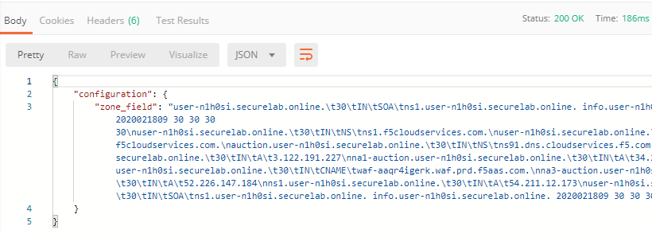

3. Query via Browser
*********************

Let's now check the created DNS service via browser. 

`a)` Copy NA1 address from the Zone file retrieved in the step above:

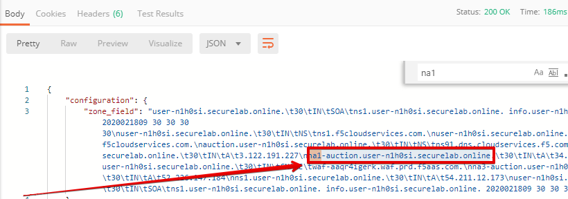

`b)` Paste the copied address into your browser and you will get to the created secondary DNS instance: 

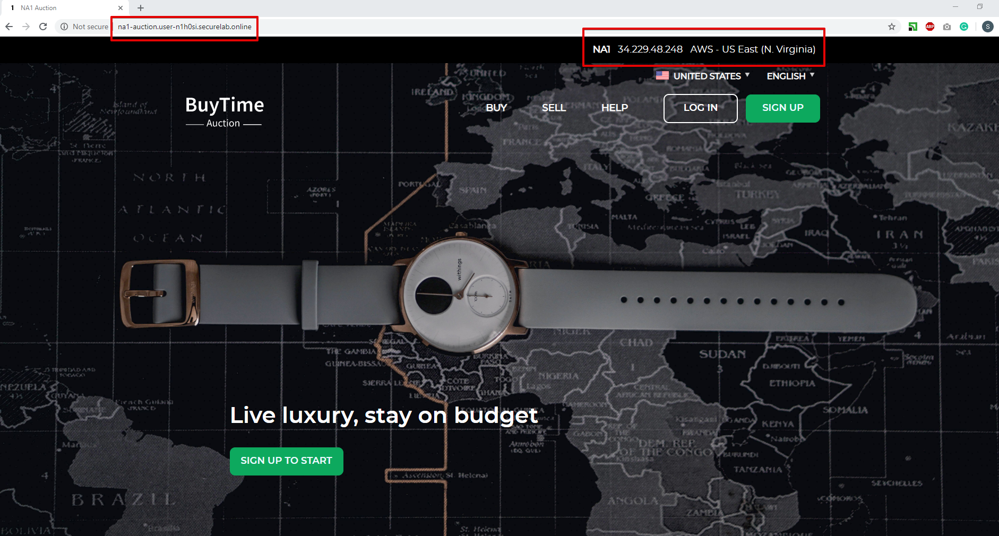

4. Review the JSON 
************************

Let's now see the structure of the JSON. In order to get the JSON, go back to Postman and send the **Get DNS JSON** request which uses your ACCESS_TOKEN to retrieve the JSON:

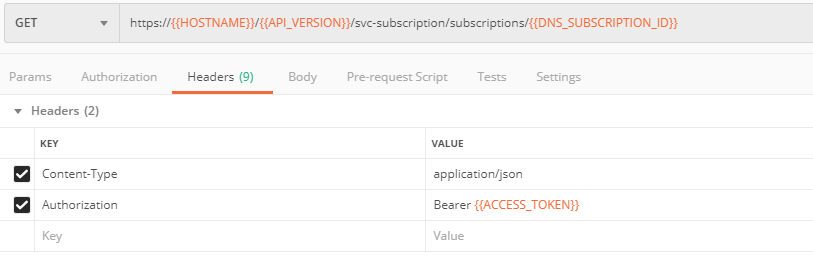

The response will retrieve the JSON containing all the DNS instance information: 

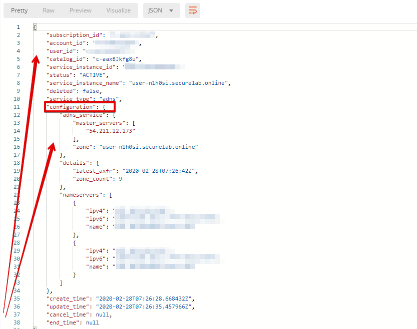

As you can see, the JSON provides some general information on subcription_id, user_id, and instance name, as well as all configuration details (service IP, zone name, etc). 

5. Delete Zone
**************

In order to delete your Zone using Postman, send the **Retire DNS Subscription** request which uses the relevant “subscription_id”.  

.. figure:: _figures/79.jpg 

You will see “retired” status in the response body which means that it’s not available on the F5 Cloud Services portal anymore.

.. figure:: _figures/80.jpg

More detailed information on these API requests can be found `here <http://bit.ly/2Gf166I>`_. 

F5 DNS Load Balancer Cloud Service - UI
#####################################

In this section we will use the F5 Cloud Services UI to set up the Load Balancer DNS record, add endpoints for our Auction app, add health checks, load balanced pools, and run through a few configuration options. 

1. Create F5 DNS Load Balancer Cloud Service
**********************************

Let’s now create DNS Load Balancer Service to be able to balance loads across multiple clouds (Azure & AWS) and provide global availability and performance with health-check and built-in DDoS protection. 

`a)` Go to the **DNS Load Balancer** tab and click **Create**. 

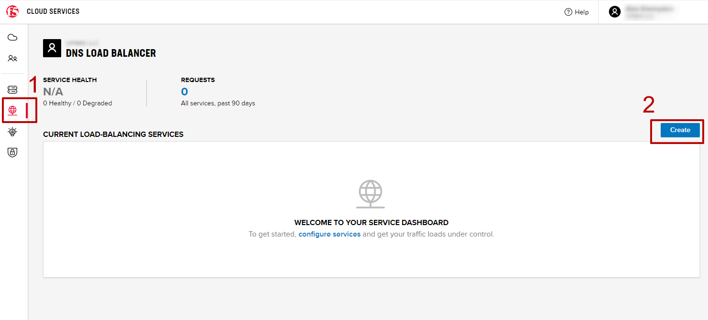

`b)` Enter name of the zone we `created before <#zone-name>`_ and click **Create**.  

.. figure:: _figures/17.png 
   
Your DNS Load Balancer instance will appear on the list but in **Inactive** status. You can change the status after creating load balanced record and pool.

2. Add Single Endpoint, Health Monitor, Pool and Default Geoproximity Rule
*********************************************************************

`a)` Create a Region

Creating regions will allow grouping incoming requests by geographic areas and directing them to specific pools.   

   `1.` Click on DNS Load Balancer instance which we have just created and go to the **Regions** tab. Click **Create**.  
  
   .. figure:: _figures/18.png 

   `2.` Fill "usa" as "Region name" and select "North America" in "Include these continents". **Save** the created region.  
  
   .. figure:: _figures/19.png 
   
   Now all requests from North America will be covered by the "usa" region.  

`b)` Add A Health Monitor

To distribute the load, DNS Load Balancer will need to monitor health of each IP Endpoint. So, let’s create a monitor.  

   `1.` Go to the **Monitors** tab and then click **Create**. 

   .. figure:: _figures/20.png 

   `2.` Fill in "health-monitor" name, choose "HTTP Standard" protocol, indicate "80" port and click **Save**.   

   .. figure:: _figures/21.png 
   
`c)` Add an IP Endpoint (NA) with Health Check

Let’s now create an IP endpoint that will currently service all incoming requests. DNS Load Balancer chooses an IP endpoint based on request origin and configuration of IP endpoints, as well as IP Endpoint health. 

   `1.` Go to the **IP endpoints** tab and then click **Create**. 
  
   .. figure:: _figures/22.png 

   `2.` Fill in name ("na1-auction"), IP address ("34.229.48.248"), port ("80") and select the monitor we created above.  
  
   .. figure:: _figures/23.png 
   
`d)` Create a Pool

Let's now create a pool and add a member to it. 

   `1.` Go to the **Pools** tab and then click **Create**. 
  
   .. figure:: _figures/24.png 

   `2.` Fill in "america" name, choose "round-robin" method and define TTL "30". Then click **Next**.  
  
   .. figure:: _figures/25.png 

   `3.` Click **Add Member** to add an IP Endpoint to the pool. 
  
   .. figure:: _figures/26.png 

   `4.` Select the endpoint we’ve just created, as well as the monitor. Click **Add** and **Create**.   
  
   .. figure:: _figures/56.png 
  
   A newly created pool with the one NA endpoint will appear on the list.    

`e)` Add a Load Balanced Record

After creating all the components (IP endpoint, Pool, Region and Monitor), we can create a DNS Load Balancer record and its     proximity rule. 

   `1.` Go to the **Load balanced records** tab and then click **Create**.

   .. figure:: _figures/118.png

   `2.` Fill in LBR name "auction", host "auction", select "A" as "Resource Record Type" and set a proximity rule ("Anywhere" -> "america" pool) to direct requests from anywhere to "america" pool with the created NA1 endpoint. Set score of the proximity rule to be "1". This will define the priority of the rule after some more are added.

   Click **Add Rule**, then check ***Enabled*** tick and **Save** the record.

   .. figure:: _figures/78.png

   `3.` Go back to the DNS Load Balancer tab, click on your service and activate it.

   .. figure:: _figures/119.png

   The DNS Load Balancer service is now setup.  

`f)` Test via Browser 

Let’s test the created service with the proximity rule via browser.  

   `1.` Open FQDN ("auction.{{zone name}}" where {{zone name}} is the value copied from postman in one of the step above) in your browser.

   .. figure:: _figures/29.png 

   `2.` You will see that acc to the proximity rule, you joined the endpoint belonging to the "america" pool. 

   .. figure:: _figures/30.png 

`g)` Test via Command Prompt 

Another way to test the new proximity rule is via **Command Prompt**.   

   `1.` Start **Command Prompt**.  

   .. figure:: _figures/70.png 

   `2.` Paste the following command to the **Command Prompt**: **nslookup "your FQDN name"** and press **Enter**.

   .. figure:: _figures/68.png 

   And you will see **34.229.48.248** IP in the response which belongs to **na1-auction** endpoint from **america** pool.  

  
3. Add Multiple Ednpoints to Load Balanced Pool & Test
**************************************************

`a)` Add More Endpoints (NA2,3) 

Let's now add a few more endpoints for load balancing of the application. Note that NA2 endpoint is deployed on Amazon AWS, whereas NA3 is running on Microsoft Azure. 

   `1.` Go back to the F5 Cloud Services portal, the **DNS Load Balancer** service, the **IP endpoints** tab and select **Create**. 
   
   .. figure:: _figures/92.png 
   
   `2.` Fill in name ("na2-auction"), IP address ("18.232.64.254"), port ("80") and select the monitor we created above.
   
   .. figure:: _figures/93.png 
   
   Create one more endpoint repeating the step above using the following properties: "na3-auction" for name, "13.82.106.211" for IP address, "80" for port. You will have three endpoints as a result. 
   
   .. figure:: _figures/94.png 
   

`b)` Add the Endpoints to the Pool

Let's now add the newly created endpoints to the existing pool. 

   `1.` Go to the **Pools** tab and click on the **america** pool.
   
   .. figure:: _figures/95.png
   
   `2.` Click **Add Member** and select the endpoint to be added. 
   
   .. figure:: _figures/96.png
   
   Add one more endpoint and click **Save**. Now all three endpoints belong to one pool:
   
   .. figure:: _figures/97.png

`c)` Test via Default Browser

Let’s test the updated pool with the new endpoints via browser.  

   `1.` Open FQDN ("auction.{{zone name}}" where {{zone name}} is the value copied from postman in one of the step above) in your browser.

   .. figure:: _figures/29.png 

   `2.` You will see that acc to the proximity rule and pool members, you will get to endpoints belonging to the **america** pool in a round-robin manner. 

   .. figure:: _figures/98.png
   
   And let's now update the page:
   
   .. figure:: _figures/99.png

4. Add Europe Region & EU Endpoint with Corresponding Geoproximity Record
******************************************************************************

`a)` Add EU Endpoint

Let's now add a EU endpoint which is deployed on Amazon AWS. 

   `1.` Go back to the F5 Cloud Services portal, the **DNS Load Balancer** service, the **IP endpoints** tab and select **Create**. 
   
   .. figure:: _figures/92.png 
   
   `2.` Fill in name ("eu-auction"), IP address ("3.122.191.227"), port ("80") and select the monitor we've created above.
   
   .. figure:: _figures/100.png 
   
   The new endpoint will appear on the list.

`b)` Add EU Region

Creating EU region will allow grouping requests coming from the European region and directing them to a specific pool.   

   `1.` Go to the **Regions** tab and click **Create**.  
  
   .. figure:: _figures/300.png 

   `2.` Fill "europe" as "Region name" and select "Europe" in "Include these continents". Save the created region.  
  
   .. figure:: _figures/101.png 
   
  Now you have two regions created.

`c)` Add EU Pool

Let's now create a pool and add a member to it. 

   `1.` Go to the **Pools** tab and then click **Create**. 
  
   .. figure:: _figures/122.png

   `2.` Fill in "europe" name, choose "round-robin" method and define TTL "30". Then click **Next**.  
  
   .. figure:: _figures/102.png 

   `3.` Click **Add Member** to add an IP Endpoint to the pool. 
  
   .. figure:: _figures/301.png 

   `4.` Select the endpoint we’ve just created, as well as the monitor. Click **Add** and **Create**.   
  
   .. figure:: _figures/302.png 
  
   A newly created pool with one EU endpoint will appear on the list.    

`d)` Update LB Record  Europe -> "europe"

Now that we have created EU pool, region and endpoint, we can update load balanced record and add a new proximity rule: to send the traffic originating in Europe to the "europe" pool, utilizing a higher relative score than the previous rule of routing traffic from "Anywhere" to the "america" pool. This type of geo-proximity based routing is useful for GDPR compliance.  

Go to the **Load balanced records** tab and click on your record. Set a new proximity rule ("europe" -> "europe" pool). Set the score of the proximity rule to be "50". 

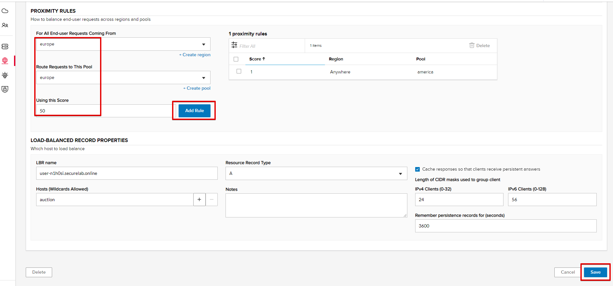

Click **Add Rule** and **Save** the record. The new proximity rule will direct requests from Europe region to **europe** pool. 

`e)` Test using the Opera Browser 

Now let’s test the new proximity rule. This can be done either via the Opera browser or via your computer’s **Command Prompt** (see the next section).  

   `1.` Open the Opera browser, copy FQDN name (“auction."your zone name"”) in **Load balanced record properties** and paste into your browser. You will get to one of three available IP endpoints of the “america” pool.

   .. figure:: _figures/50.png 

   `2.` Let’s now test the EU proximity rule. Click **VPN** and select **Europe**. This will simulate your entering BuyTime Website from Europe.

   .. figure:: _figures/8.png 

   `3.` Update your "auction."zone name"" page to see that acc to the proximity rule, you switched to the European pool. 

   .. figure:: _figures/9.png 

`f)` Test via Command Prompt 

Another way to test the new proximity rule is via **Command Prompt**.   

   `1.` Start **Command Prompt**.  

   .. figure:: _figures/70.png 

   `2.` Paste the following command to the **Command Prompt**: "nslookup auction.cloudservicesdemo.net 198.6.100.25". 

   .. figure:: _figures/68.png 

   And you will see **34.229.48.248** IP in the response which belongs to **na1-auction** endpoint from **america** pool.  

   `3.` Now let’s check the **europe** pool. Paste the following command to the **Command Prompt**: **nslookup auction.cloudservicesdemo.net 158.43.240.3**. 

   .. figure:: _figures/71.png 

   And you will see **3.122.191.227** IP in the response which belongs to **eu-auction** endpoint from **europe** pool. 

5. Duplicate Load Balanced Record using JSON through the UI  
*****************************************************************

Let's now duplicate a load balanced record and its configuration in the existing Load-balancing service via the F5 Cloud Services portal. To do that, follow the step below: 

`a)` Get JSON

Go to the **DNS Load Balancer** tab in the portal and click on your existing Load-balancing service. Open the **JSON configuration** tab and copy it.  

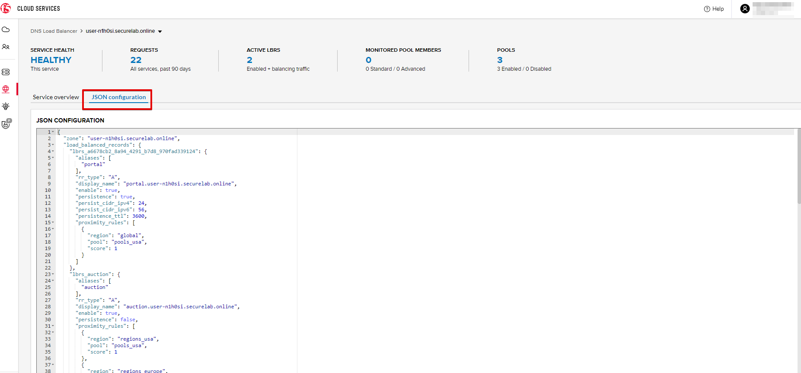

`b)` Create New Load Balanced Service 

Let's now create a new Load-balancing service via UI to copy the record to. To do that, you will first need to get “zone2”.  

   `1.` Go back to Postman and open **Get DNS Zone(lab)** request.  Copy "zone2" which is returned in its response.  

   .. figure:: _figures/84.png 

   `2.` Open any text editor (say, **Notepad**) and paste the **JSON configuration**. Replace the existing zone name with the "zone2" copied from the Postman in the step above:  

   .. figure:: _figures/83.png 

   A new JSON configuration with the properties copied from the existing zone is ready.  

   `3.` Return to the F5 Cloud Services portal and open the **DNS Load Balancer** tab. Click **Create**. 

   .. figure:: _figures/85.png 

   Paste "zone2" name which you copied in step 1 above and click **Create**.  

   .. figure:: _figures/86.png 

`c)` Update JSON 

Уou have just created a new Load-balancing service. Let’s configure it by duplicating the Load balanced record from the existing service.  

Click on your newly created service and open the **JSON configuration** tab. Paste the JSON which you created in step b) 2. above and click **Save**.    

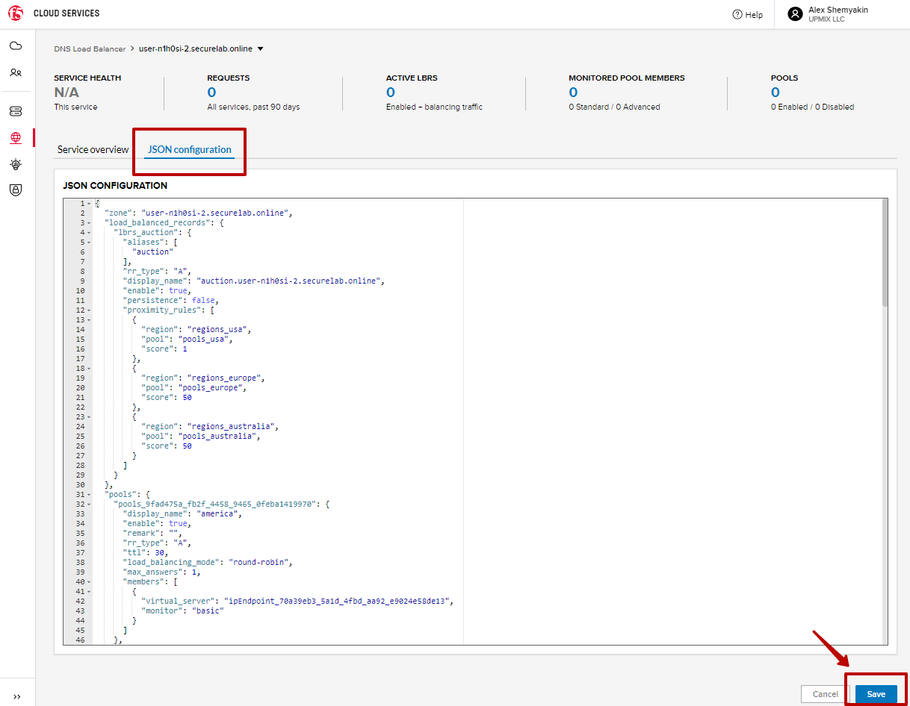

Go back to the newly created Load-balancing service to see the newly created record which is the copy of the original one.  

`d)` Go back to the DNS Load Balancer tab and activate the new DNS Load Balancer service by selecting **Activate** button:

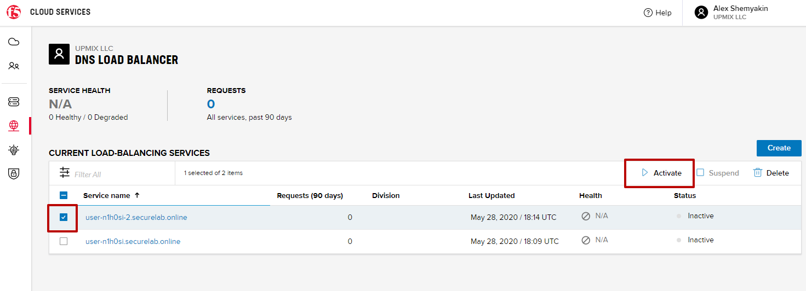

Status will be updated a few seconds later.

`e)` Test via Browser

   `1.` Open FQDN ("auction.{{zone-2 name}}" where {{zone-2 name}} is the value copied from postman in one of the step above) in your browser.

   .. figure:: _figures/123.png

   `2.` You will see that acc to the proximity rule and pool members, you will get to endpoints belonging to the **closest** pool in a round-robin manner.

   .. figure:: _figures/106.png
   
6. Delete DNS Load Balancer Service
******************************************

   `1.` Go back to the F5 Cloud Services portal, the **DNS Load Balancer** tab, and click on your load-balancing service.  
   
   .. figure:: _figures/107.png
   
   `2.` Tick the records and click **Delete**, then confirm your choice.
   
   .. figure:: _figures/108.png

F5 DNS Load Balancer Cloud Service - API
#######################

1. Create DNS Load Balancer Subscription
***************************

Select the **Create GSLB Subscription** request and click **Send** to create a new service instance of DNS Load Balancer using “account_id” and “catalog_id” retrieved a few steps above.

.. figure:: _figures/95.jpg 

You will see “subscription_id” and created ”service_instance_id” in the body. You may also note that this request will create only NA1 endpoint for now. Some more will be created in the subsequent requests. 

You may also notice that the current proximity rule is set to send traffic from: Everyone -> Americas pool. This means that only one endpoint (NA1) will be serving all requests now. We will subsequently configure proper load balancing and geoproximity rules. 

.. figure:: _figures/48.jpg 

The retrieved "subscription_id" is then stored for subsequent calls. 

.. figure:: _figures/47.jpg 

You can change its status from "DISABLED” to “ACTIVE” sending the **Activate GSLB Subscription** request below.

More detailed information on this API request can be found `here <http://bit.ly/36fvHLX>`_.  

2. Activate DNS Load Balancer Subscription
*************************************************

Select the **Activate GSLB Subscription** request and click **Send**. This will deploy DNS Load Balancer using “subscription_id” captured in one of the steps above.

.. figure:: _figures/49.jpg 

You will see “active” subscription status. 

.. figure:: _figures/50.jpg 

More detailed information on this API request can be found `here <http://bit.ly/36h6tgj>`_. 

3. Test NA Pool 
***************************

Send the **Test NA Availability (lab)** request to execute a call against the Lab service API, which in turn uses an external VM (located in the USA) to run a "wget" to retrieve the response from http://auction.cloudservicesdemo.net. This should show the only available instance NA1 in the HTML that is returned. 

.. figure:: _figures/52.jpg 

The response shows that your first instance is available: 

.. figure:: _figures/53.jpg 

4. Add Endpoints & Pool Members
***************************

Send the **Add Endpoint & Pool Members** request to add a few more endpoints for load balancing of the application. Note that three of the new endpoints (EU and NA2) are deployed on Amazon AWS, and one (NA3) is running on Microsoft Azure. NA1, NA2, and NA3 endpoints are aggregated into a pool "usa", which demonstrates multi-cloud load balancing. 

.. figure:: _figures/54.jpg 

You will see all the information on the added endpoints: 

.. figure:: _figures/55.jpg 

5. Test Round Robin (lab)
***************************

Run the **Test Round Robin (lab)** request to check the response from the Lab service API to test what instance is now being returned. This should show a result different from the previous due to the newly-configured round-robin load balancing. 

**NOTE**: it's possible that you will still get the same endpoint in the response due to either DNS caching or 1/3 chance of the same endpoint to be pulled from the load-balance pool. Let's try: 

.. figure:: _figures/56.jpg 

And check the response: 

.. figure:: _figures/57.jpg 

You can send the same request to check other instances. 

6. Update Proximity Rule
***************************

Run the **Update Proximity Rules & Regions**. This adds a new region "europe", and assigns a EU endpoint to it. It also updates the DNS Load Balancer with new proximity rules: to send the traffic originating in Europe to the "europe" pool, utilizing a higher relative score than the previous rule of routing traffic from "Anywhere" to the "usa" pool. This type of geo-proximity based routing is useful for GDPR compliance. 

.. figure:: _figures/58.jpg 

And you will see all the information on available pools and regions: 

.. figure:: _figures/76.png 

7. Test Proximity Rules (lab)
***************************

Send the **Test Proximity Rules (lab)** request, which uses an external VM (located in Europe) to run a "wget" to retrieve the response from http://auction.cloudservicesdemo.net. This simulates what an EU-based customer would see when opening this URL in their browser. NOTE: you can also test this in your Opera browser (using EU proxy), the way you've done it previously with the UI. 

.. figure:: _figures/60.jpg 

Here’s what you should see in the response: 

.. figure:: _figures/61.jpg 

8. Review the JSON 
******************

Let's now see the structure of the JSON. In order to get the JSON, send the **Get GSLB JSON** request which uses your ACCESS_TOKEN to retrieve the JSON:

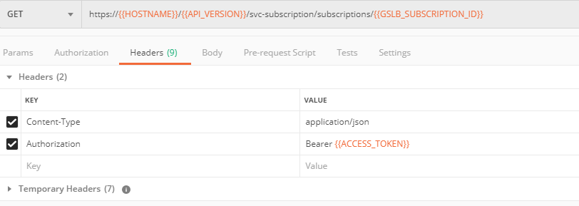

The response will retrieve the JSON containing all the DNS Load Balancer instance information: 

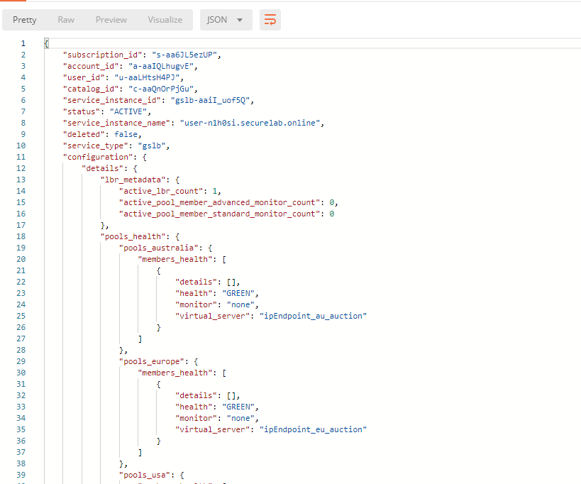

As you can see, the JSON provides some general information on subcription_id, user_id, and instance name, as well as all configuration details. The configuration section "details" includes information on "pools_health": 

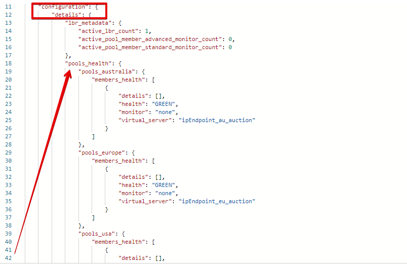

The next configuration section is "gslb_service" which contains "load_balanced_records" with their "name" and "proximity_rules": 

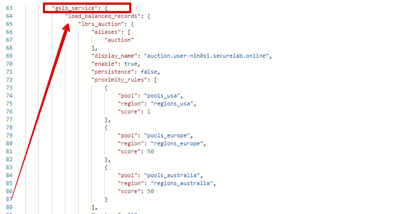

It also includes "pools" section with their "name", "load_balancing_mode" and "members": 

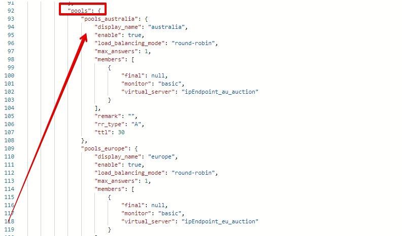

One more section is "regions" which includes information on region "names" and "sectors": 

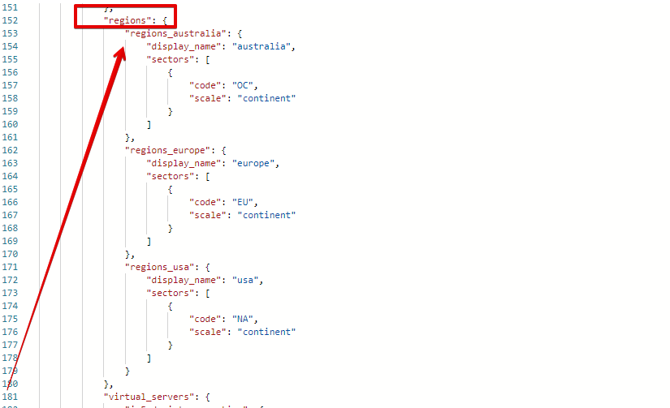

And another section provides information on "virtual_servers": their IP endpoints, addresses, names, monitors and ports: 

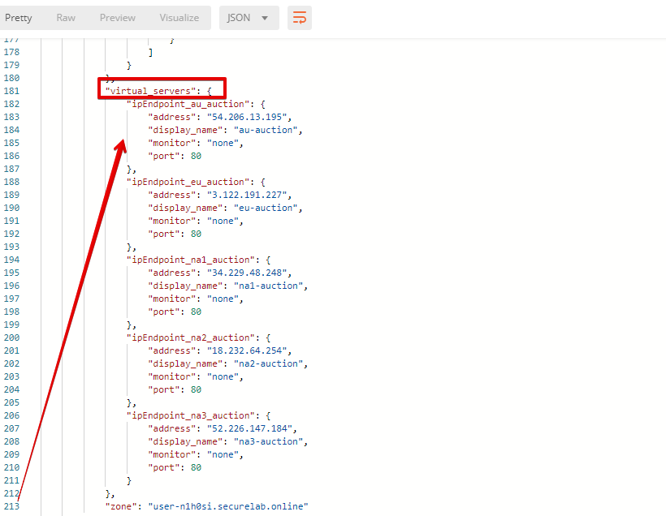

9. Delete DNS Load Balancer Service
******************

Send the **Retire GSLB Subscription** request which uses the relevant “subscription_id”.

.. figure:: _figures/81.jpg

You will see “retired” status in the response body which means that it’s not available on the F5 Cloud Services portal anymore.

.. figure:: _figures/80.jpg

Clean Up
########

Send the **Retire DNS Zone** to remove or reset zone file. You will get response with status code "200 OK".

.. figure:: _figures/120.jpg

We recommend that you clear your tokens from the Lab Service API for security purposes. In order to do that, send the **Logout** request, which uses your **ACCESS_TOKEN**:
   
.. figure:: _figures/79.png

You will get the following response with the status showing "200 OK":
   
.. figure:: _figures/80.png
   
Your **ACCESS_TOKEN** will be considered invalid:
   
.. figure:: _figures/81.png

