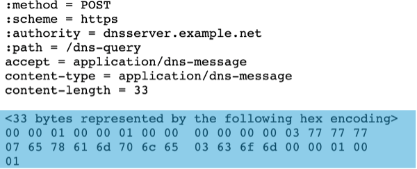

Class 6 - Native DNS over HTTPS/DNS over TLS
=====================================

Introduction
~~~~~~~~~~~~

DNS over HTTPS (DoH) & DNS over TLS (DoT) are protocols for performing Domain Name System (DNS) resolution via the HTTPS protocol or via TLS (Transport Layer Security) encryption. The goal of both DoH and DoT is to provide increased security and end-user privacy on an otherwise open and transparent DNS query and response.  It is worth noting that DoH is NOT DNS protocol – it uses the HTTP/2 protocol. 

BIG-IP DNS decrypts and resolves DNS queries over HTTPS (DoH) without affecting RPS. DNS over TLS (DoT) ensures that DNS requests and responses are not tampered with or forged via on-path attacks.

Starting in BIG-IP 16.1, F5 now includes profiles that support DNS over HTTPS.  These DoH profiles are included with the Local Traffic Manager + DNS license.  The BIG-IP supports DoH in the following modes:

-  BIG-IP DoH Proxy—A passthrough proxy that proxies the client’s DoH request to a backend DoH server and the backend DoH server’s response back to the DoH client.  In “F5-speak”, this is a full HUDCHAIN with DoH support on both the client and server sides of the connection.

-  BIG-IP DoH server— In this method, BIG-IP terminates the DoH connections and all subsequent DNS requests are handled by the DNS profile on the BIG-IP.

-  The DoH-Server translates the client’s DoH request into a standard DNS request and forwards the DNS request using TCP or UDP to the configured DNS server or pool, such as the BIG-IP named process or the BIG-IP DNS cache feature. When the BIG-IP system receives a response from the configured DNS server, it translates the DNS response into a DoH response before sending it to the DoH client.

.. note::
   F5 has support for DNS over HTTPS on BIG-IP versions prior to 16.1.0 via an iRuleLX implementation (Link here: https://clouddocs.f5.com/training/community/dns/html/class5/class5.html).  This iRulesLX method will still be supported, but BIG-IP’s native LTM and DNS profiles created for DoH are the preferred method for implementation

DoH, on its own, is somewhat complex and is not DNS from a protocol perspective, meaning that traditional DNS tools cannot understand it. It is done with either HTTP GET or HTTP POST and uses tcp/443 along with TLS1.3 and encrypted SNI. Using the BIG-IP DNS, we can convert either method from DoH to a standard DNS query (DoH to DNS). For the HTTP GET method, we must take the DNS request, encode the URL with base64url, and then encapsulate it into a binary HTTPS payload, as seen here:

For the HTTP POST method, we must take the DNS request, encode the DNS message in DNS Wire Format, and then encapsulate it into the HTTPS payload, as seen here:

We can also do the same thing in reverse by converting a standard DNS request into a DoH formatted/encapsulated request (DNS-to-DoH), so that standard DNS clients can communicate with DoH Servers.

.. note::
   In this lab, we will configure DoH-SERVER (DoH to DNS) objects for testing.

DoT, on the other hand, is “simpler” to proxy as it is considered DNS from a protocol perspective, with an added TLS wrapper for transport security. In fact, in its simplest terms, the original DNS protocol is simply sent on tcp/853 and encapsulated in TLS using client-SSL (DoT-to-DNS) or server-SSL (DNS-to-DoT) profiles. This allows for remarkably simple lookups using standard DNS utilities, such as ‘kdig’, with the ‘+tls’ directive:

Lab Overview
~~~~~~~~~~~~

This lab consists of two primary sections:

-  Proxying DNS queries over HTTPS to traditional DNS servers

   -  In this section, you will use Mozilla Firefox as a DoH client to browse the web using encrypted DNS through the BIG-IP using DNS over HTTPS

-  Proxying DNS queries over TLS to traditional DNS servers

   -  In this section, you will use the kdig utility as a DoT client to perform queries through the BIG-IP using DNS over TLS

.. toctree::
   :maxdepth: 1
   :glob:

   topology
   components
   configuration
