BIG-IP Configuration Review
---------------------------

Launch your RDP client and connect to the Windows Jump Host.

Be sure to use the correct username and password on the RDP connection to get started. You will need to remove the “Administrator” and replace with “user”:

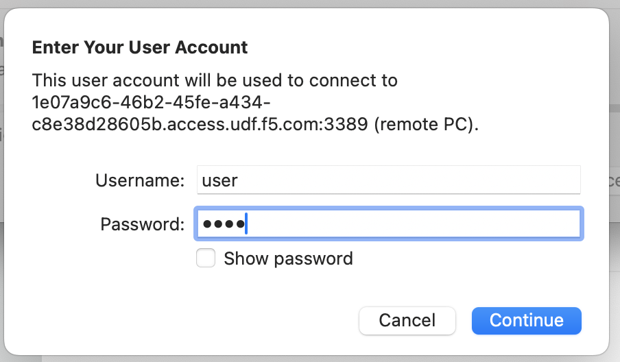

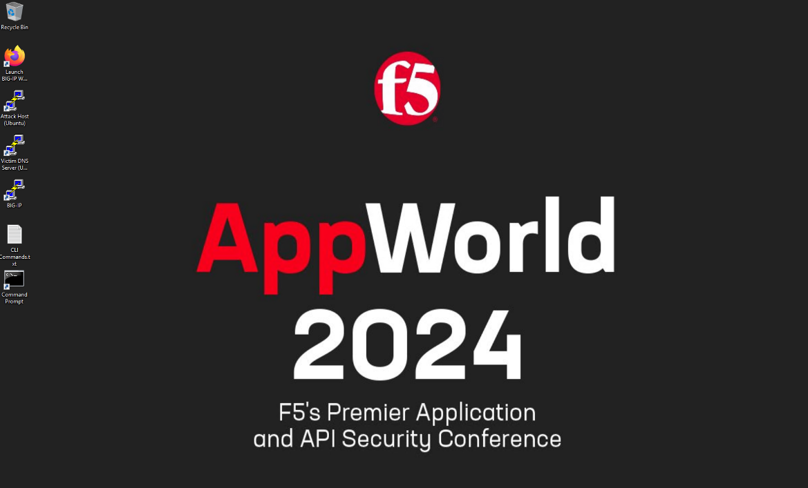

Click “No” to close the network discovery prompt.

Click on the Firefox icon to launch the browser.  The default homepage should be set to the BIG-IP Web-UI:  https://10.1.1.8/ - but if not, navigate to this location to get started.  Let’s login using **admin** for our username and **default** as our password (as seen on the banner):

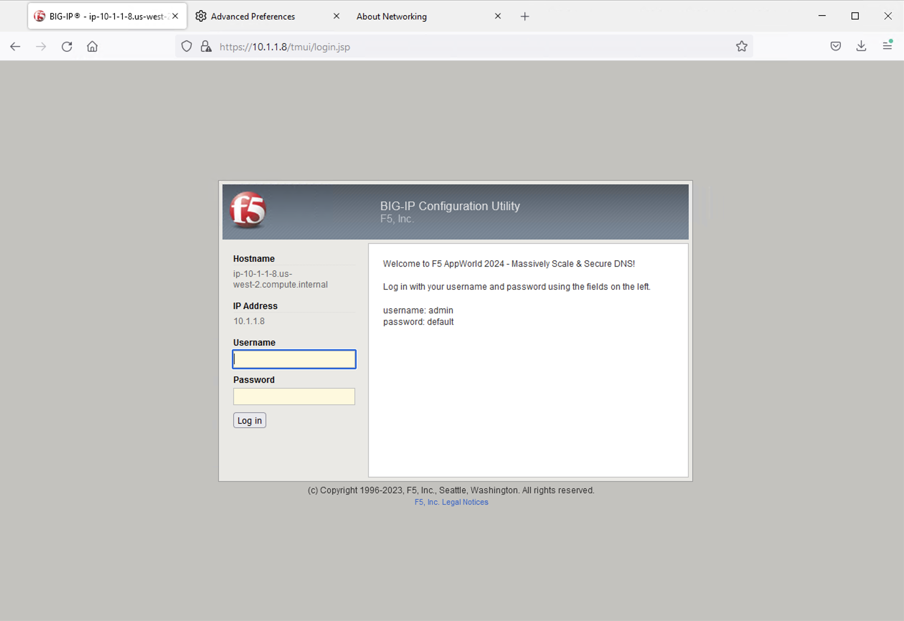

System Configuration
~~~~~~~~~~~~~~~~~~~~

Resource Provisioning
^^^^^^^^^^^^^^^^^^^^^

First, let’s look at how the platform’s modules are provisioned. Navigate to **System** -> **Resource Provisioning** in the menu. You will see that we have LTM and DNS provisioned. We’ll need both of these modules for handling DNS connections and translating between DNS and HTTPS.

.. note:: Other F5 software modules, including AFM and/or AVR, may also be provisioned in this Lab BIG-IP.  These modules are used for other DNS labs, including DNS DDoS testing, and should be ignored at this time

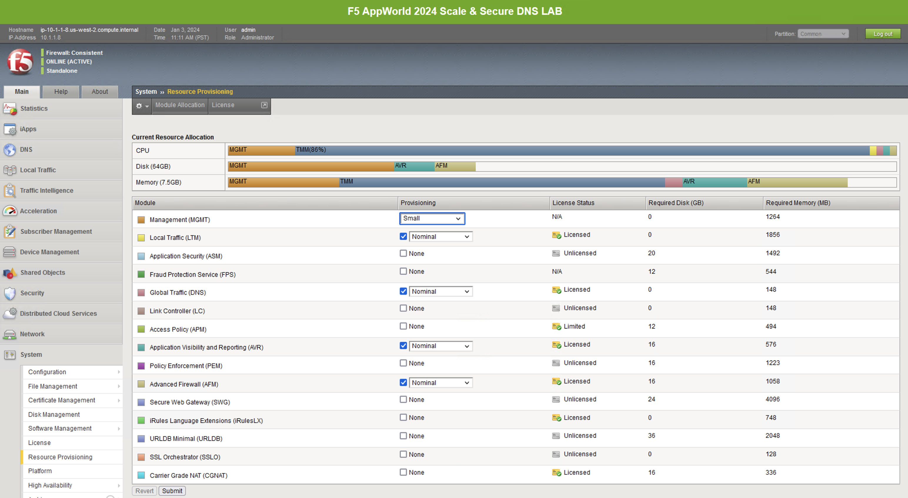

NTP
^^^

Next, let’s look at a few key system settings necessary for overall system health. Navigate to **System** -> **Configuration** -> **Device** -> **NTP**. It’s important that NTP is configured and working properly on all BIG-IPs, especially when deployed in a cluster and/or when managed by BIG-IQ.

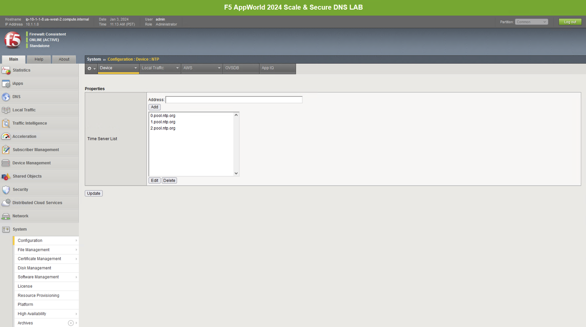

DNS
^^^

Navigate to **System** -> **Configuration** -> **Device** -> **DNS**

Because we’re using FQDNs in our DNS pools, we’ll need a DNS resolver(s) that the BIG-IP can use to resolve them.

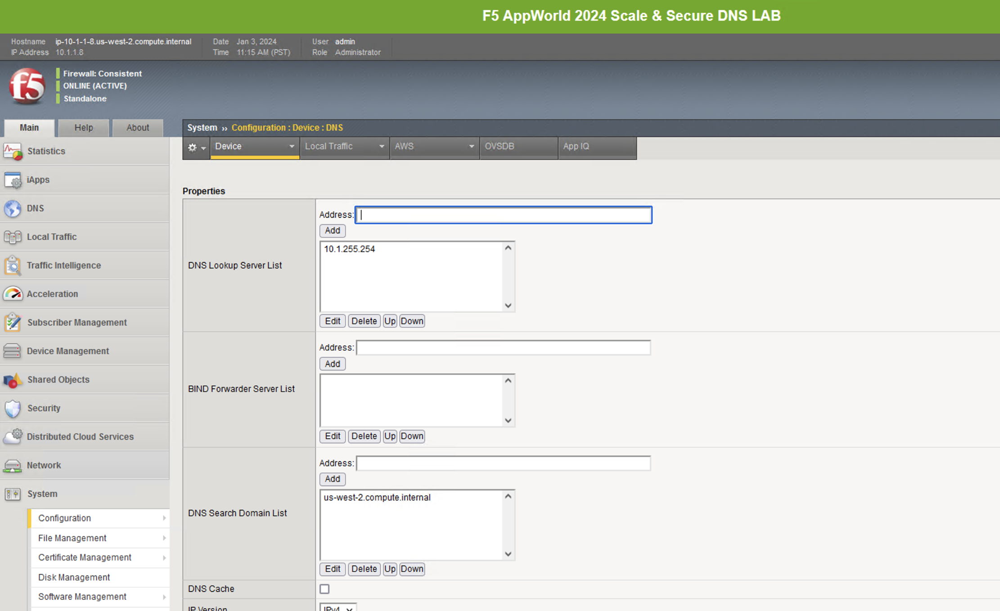

Network Configuration
~~~~~~~~~~~~~~~~~~~~~

The BIG-IP sits in two VLANs with self-IPs in each. One side serves up the DNS VIPs and the other is used to reach DNS servers. If you wish to view this part of the config, you can click on the respective sections under the Network menu. Please do not make any changes.

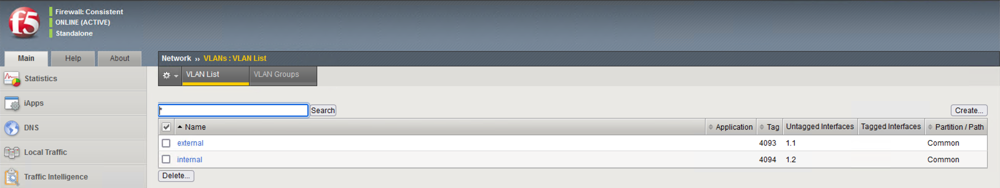

Local Traffic Manager (LTM)
~~~~~~~~~~~~~~~~~~~~~~~~~~~

Let’s now look at the portion of the configuration that is performing the heavy lifting – the LTM configuration.

Nodes
^^^^^

Navigate to **Local Traffic** -> **Nodes** and look at the node list. Here, we’re resolving dns.google (an FQDN-based, auto-populated node) and automatically creating pool members based on the records returned.

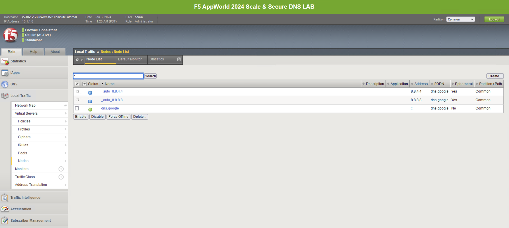

Pools
^^^^^

Navigate to **Local Traffic** -> **Pools**, and you will see three pools. While the backend nodes are identical between them, the ports used for each are not. You’ll see a pool for DNS over HTTPS (doh_dns.google) that uses port 443, a pool for DNS over TLS (dot_dns.google) that uses port 853 and finally a pool that uses port 53 for traditional DNS services (traditional_dns.google). If you’re not familiar with LTM pools, click through each pool to see how the service ports are specified.

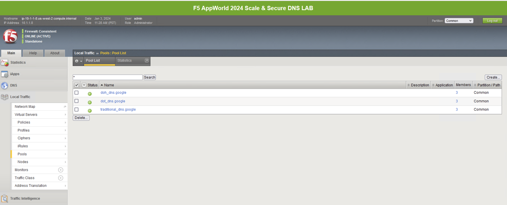

Virtual Servers 
^^^^^^^^^^^^^^^

Finally, let’s take a look at the virtual servers handling incoming requests. Navigating to **Local Traffic** -> **Virtual Servers** will bring up the list.

The first two virtual server objects handle inbound DoH and DoT requests, respectively: **DoH-to-DNS** and **DoT-to-DNS**. An example use case for these proxies would be for offering DoH/DoT to clients/customers/etc. without the need for changing existing DNS infrastructure.
We also have a **DoH-to-DoH-vs** virtual server.  This is a bit more of a corner use case but would provide a full DOH-proxy from client to the BIG-IP Virtual Server, hit the DoH-proxy profile, and re-encrypt on its way to the DoH-DNS server in the pool or DNS profile.  

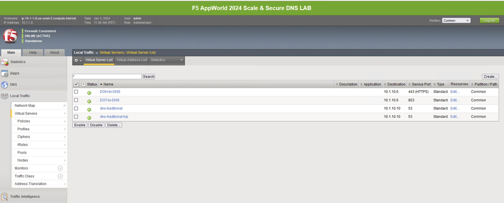

DNS to DoH Proxy
^^^^^^^^^^^^^^^^

For DoH use cases, there are two types of GTM/DNS listeners that can be used within the BIG-IP: **listener-doh-server** and **listener-doh-proxy**.  These listeners hard code **ip-protocol** to **tcp** and the port to 443 by default.  The DoH-to-DNS Virtual server in our lab is built using the **listener-doh-server** profile.

These DoH specific Proxy and Server Listener profiles can be found in two places within the BIG-IP Web UI:  

-  Navigating to **DNS -> Delivery -> Listeners**
-  Navigating to **LTM -> Profiles -> Other**

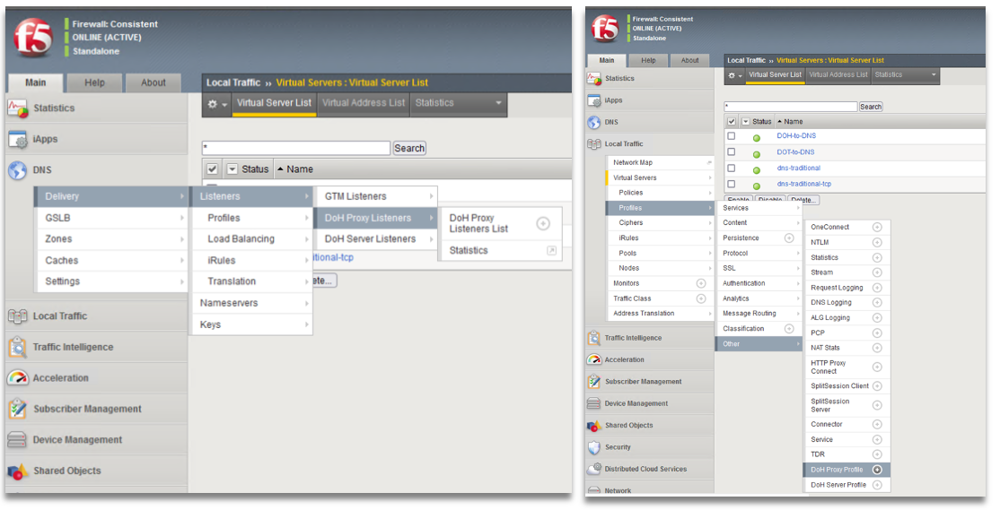

Due to the unique nature of the DoH-Server profiles applied to the configuration, it is worthwhile to review the configuration of the DoH-to-DNS Virtual Server before continuing to the next page of the Lab Guide.  The DoH-Server DNS listeners have enforcement rules that make them unique when compared to standard BIG-IP virtual servers and different even from the DoT-to-DNS VS. 

.. note:: When you configure a **doh-server** type DNS listener from within the DNS menu of the UI, the **https, http2, http, tcp,** and **doh-server** profiles are automatically added.  If you attempt to remove any of these profiles from the listener, you will get a validation error.  This is an expected behavior for this type of BIG-IP listener.  For the **doh-proxy** type DNS listener, the **httprouter** and server-side SSL profiles are also added to the base configuration and is a **required** element.

To configure, modify, or delete these GTM/DNS listener objects from within TMSH, the commands are as follows: ::

   create gtm listener-doh-server <name> address <address> [...]
   modify gtm listener-doh-server <name> [...]
   delete gtm listener-doh-server <name>
   create gtm listener-doh-proxy <name> address <address> [...]
   modify gtm listener-doh-proxy <name> [...]
   delete gtm listener-doh-proxy <name>

**Minimum profile list for listener-doh-server:**
::

   profiles {
      /Common/dns { }
      /Common/doh-proxy { }
      /Common/clientssl-secure { context clientside } 
      /Common/http { }
      /Common/http2 {context clientside }
      /Common/tcp { }
   }

**Minimum profile list for listener-doh-proxy:**
::

   profiles {
      /Common/dns { }
      /Common/doh-proxy { }
      /Common/serverssl-secure { context serverside }
      /Common/clientssl-secure { context clientside } 
      /Common/http { }
      /Common/http2 { }
      /Common/httprouter { }
      /Common/tcp { }
   }

For this lab, we created these DoH Virtual Servers via the GTM/DNS listener process.  However, the DoH listener virtual server can also be created via the standard LTM virtual server configuration as well.  We will share this configuration in both Web UI and TMSH formats.

.. note:: The following steps are NOT part of this lab exercise but are shared to help the student understand the process and steps required to create this virtual server object on the BIG-IP system.

Creating a DoH Virtual Server (tmsh)
~~~~~~~~~~~~~~~~~~~~~~~~~~~~~~~~~~~~

To create a DoH Server virtual server listener, the following example configuration is provided.  In this example, we use a traditional udp/tcp 53 dns pool for this, as our VS will convert HTTP/2 to traditional DNS: ::

  tmsh create ltm virtual lab_doh_server ip-protocol tcp profiles add { dns doh-server http http2 tcp clientssl-secure } source-address-translation { type automap } destination 10.1.10.7:443 pool traditional_dns.google

To create a DoH Proxy virtual server listener – as mentioned in the note above, the doh-proxy type vs will require the “httprouter” profile and a Server-Side SSL profile applied.  This virtual server uses a DoH server pool, as the output of the VS will be to servers listening on HTTPS/DoH: ::

   tmsh create ltm virtual lab_doh_proxy ip-protocol tcp profiles add { dns doh-proxy http http2 httprouter tcp clientssl-secure serverssl-secure } source-address-translation { type automap } destination 10.1.10.6:443 pool doh_dns.google

Creating a DoH Virtual Server (Web UI)
~~~~~~~~~~~~~~~~~~~~~~~~~~~~~~~~~~~~~~

You can create a virtual server on the BIG-IP system where clients send DoH HTTP/2 application requests.  Due to the extremely specific nature of the DoH virtual servers, some fields and configurations are required and will generate an error if not applied correctly.  

#. 1.	On the **Main** tab, click Local **Traffic -> Virtual Servers**. The Virtual Server List screen opens.
#. Click **Create** and The New Virtual Server screen opens
#. In the **Name** field, type a unique name for the virtual server, e.g. *ex: vs_lab_doh_server*
#. In the **Destination Address/Mask** type an address, as appropriate for your network. The supported format is address/prefix, where the prefix length is in bits. For example, an IPv4 address/prefix is ``10.0.0.1`` or ``10.0.0.0/24``, and an IPv6 address/prefix is ``bead:feed:cab1::42/64`` or ``2001:ed8:77b5:2:10:10:100:42/64``. When you use an IPv4 address without specifying a prefix, the BIG-IP system automatically uses a /32 prefix
#. In the **Service Port** field, type 443, or select **HTTPS** from the list
#. If not already selected, change the **Configuration:** pulldown menu to **Advanced**
#. In the **DoH Profile Type** menu, select DoH Server Profile

   .. note:: When this **DoH Profile Type** is applied, several other Virtual Server configuration objects will become grayed out in the Web UI to ensure they are not selected or modified for this deployment.

#. In the **Protocol Profile (Client)** menu, select a TCP-based profile. Our lab uses **f5-tcp-lan**.
#. In the **Protocol Profile (Server)** menu, select a UDP-based profile. Our lab uses **udp_gtm_dns**.
#. In the HTTP Profile (Client), select an http profile. Our lab uses the default **http** profile.
#. In the **SSL Profile (Client)**, select a client-ssl profile from the available options and click “<<” to move it to the Selected menu. Our lab uses **clientssl_F5AppWorld2024** which uses a self-signed certificate. In the DoH HTTP/2 virtual server configuration, renegotiation must be disabled in the **client-ssl** profile.  For more on this topic, please visit F5 KB article K73152709: https://my.f5.com/manage/s/article/K73152709 
#. In the **DNS Profile** menu, select a profile from the pulldown menu. Our lab uses the default **dns** profile.
#. From the **Source Address Translation** list, select the appropriate translation. Our lab uses the built in *auto map* feature.
#. In the **Address Translation** field, make sure *Enabled* is selected. This should be on by default when a **DoH Profile** is selected.
#. In the **Port Translation** field, make sure *Enabled* is selected. This should be on by default when a **DoH Profile** is selected.
#. In the **HTTP/2 Profile (Client)** menu, select an http2 profile from the available options. Our lab uses the defautl *http2* profile
#. In the **HTTP/2 Profile (Server)** menu, make sure *None* is selected
#. From the **Default Pool** list, select the pool that is configured for the application server. Our lab uses *traditional_dns.google*
#. Click **Finished**

Proxying DNS over HTTPS Queries to Traditional DNS
~~~~~~~~~~~~~~~~~~~~~~~~~~~~~~~~~~~~~~~~~~~~~~~~~~

Certificate Requirements for DoH/DoT Virtual Servers
^^^^^^^^^^^^^^^^^^^^^^^^^^^^^^^^^^^^^^^^^^^^^^^^^^^^

.. note:: : DNS over HTTPS requires a valid server-side & client-side certificate. In our lab, we created a self-signed CA certificate and a self- signed certificate for the server. We loaded those certificates into your Firefox browser so that the browser will trust the BIG-IP DoH resolver. 

Mozilla Firefox, Chrome, and Edge all offer ways to configure DNS over HTTPS.  As of today, Safari does not offer support for DoH.  Unfortunately for all of the browsers that support it, as of this document’s creation (January 2024), it is not possible to reverse engineer the implementation, which means that if it doesn't work, your browser won't load the page with ERR_NXDOMAIN (or equivalent).  Firefox's and Chrome's developer tools do not show the DoH network exchange so if anything fails in the process (invalid server certificate on the DoH server, network error), end users won't be able to troubleshoot the problem.  

If for **ANY** reason the “DNS lookup” test (below) fails, first test that the local Firefox browser trusts our self-signed, preloaded certificate. Open a browser window to  https://10.1.10.6/ and “proceed” with the validation steps, if required.  When visiting the previous link, you should receive a “invalid request” response with “DoH requires header Accept:application/dns-message”) if the self-signed certificates are working/trusted.

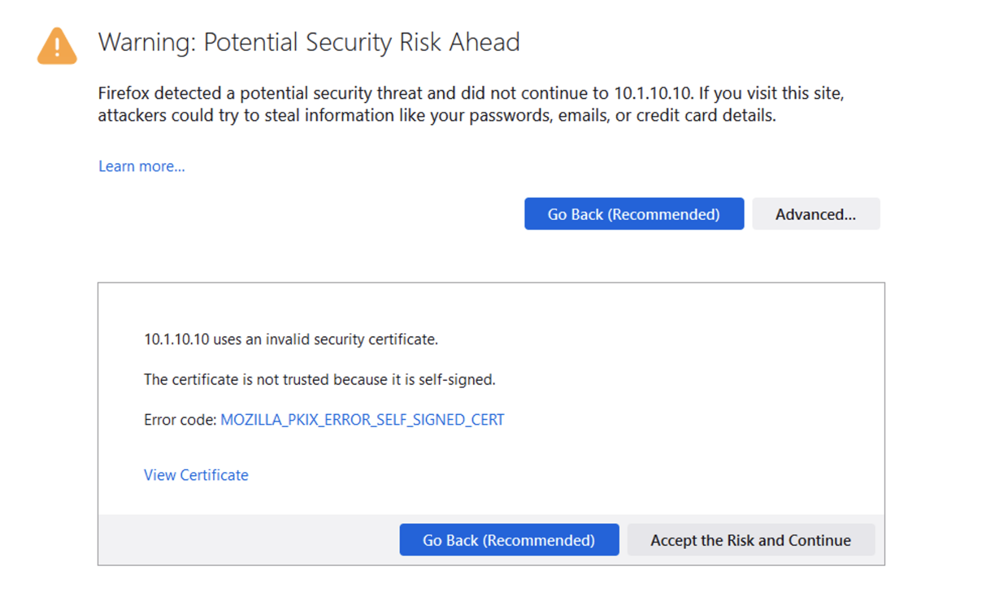

In a real-world scenario, you would need a certificate signed by a well-known certificate authority and loaded into the BIG-IP and attached to the client-ssl profile in use for DoH/DoT listeners. Most DoH clients, including Firefox & Chrome, will not trust a DoH server if the certificate is not signed by a known certificate authority.  

Test Driving DNS over HTTPS to Traditional DNS
^^^^^^^^^^^^^^^^^^^^^^^^^^^^^^^^^^^^^^^^^^^^^^

Now, let’s generate some traffic and see the translations in real-time.

**Firefox Configuration**

For this test, we’re going to use Firefox as our DoH client. Open a new tab or click the second tab in Firefox to view the about:config page. On the top of that page, you’ll see a search box. Enter *trr* and press enter to see the DoH (trusted recursive resolver) configuration.

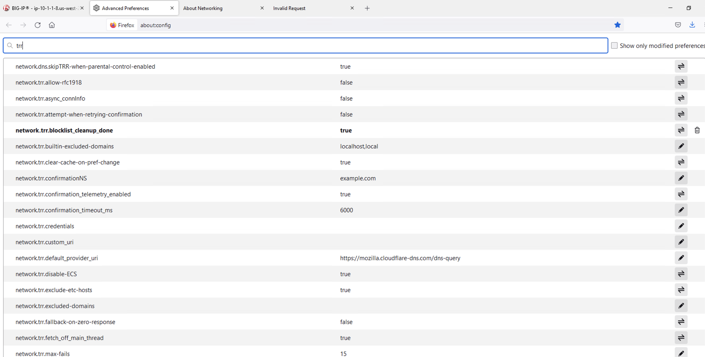

We’ve pre-configured a few things for you. First, we set **network.trr.uri** to our custom virtual server URL (https://10.1.10.6/dns-query). We have also enabled **network.trr.useGET** as it’s a bit faster than using POST, but you’re welcome to test using POST as well. We set **network.trr.mode** to **3**, which means we want Firefox to only use DoH. This will not be a typical configuration as Firefox defaults to traditional DNS when a DoH request fails. That explains the differing timeout values just below that setting. The **network.dns.skipTRR-when-parental-control-enabled** disables Firefox’s feature that disables DoH when parental control via DNS is sensed on the network. 

**Firefox Network Utilties**

Clicking on or opening a third tab in Firefox will open the networking tools page within the browser (*about:networking*). This is a terrific way to see if DoH (TRR in Mozilla-speak) is working. Click on **DNS Lookup** to bring up the DNS query tool.

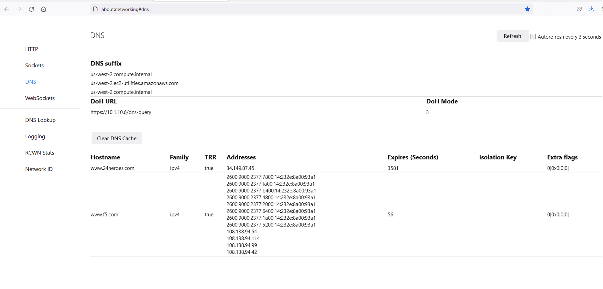

DoH in Action
^^^^^^^^^^^^^

Open a new tab and browse to a website. Return to the third tab and click Refresh to see the updated DNS cache table.

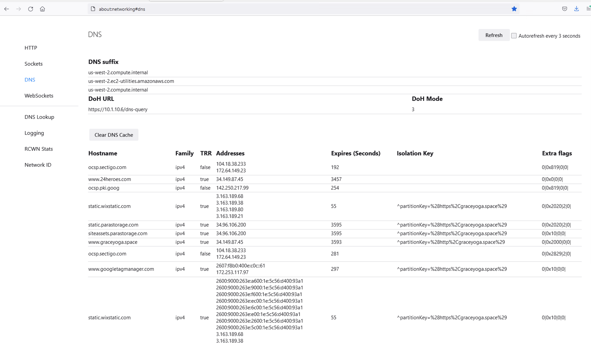

BIG-IP Statistics and Logging
^^^^^^^^^^^^^^^^^^^^^^^^^^^^^

Back in the first tab on the F5 web UI, navigate to **Statistics -> Module Statistics -> Local Traffic**. Make sure that *V*irtual Servers* is selected in the *Statistics Type* drop-down. Observe the traffic statistics on the DoH-to-DNS virtual server.

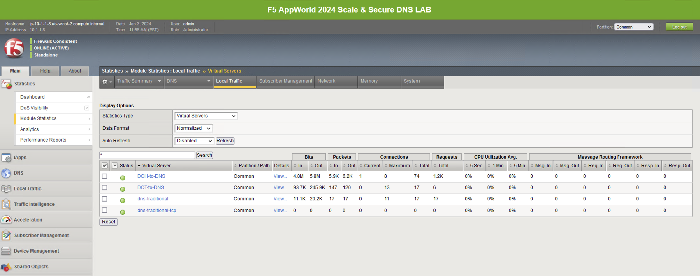

Capturing DNS over HTTPS Queries to Traditional DNS Traffic
^^^^^^^^^^^^^^^^^^^^^^^^^^^^^^^^^^^^^^^^^^^^^^^^^^^^^^^^^^^

Finally, minimize *Firefox* to reveal the CLI shortcuts on the desktop:

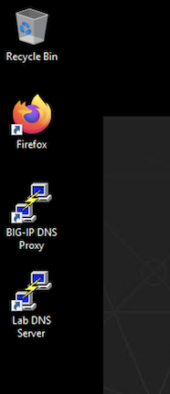

First open the BIG-IP DNS Proxy link to bring up the BIG-IP’s CLI. Once running, then let’s start a capture that will show us both sides of the DoH proxy:  ::
   
   tcpdump -nni 0.0 '(host 10.1.1.4 and host 10.1.10.6 and port 443) or (host  8.8.4.4 or host 8.8.8.8 and port 53)'

Once running, maximize *Firefox* and perform another DNS lookup. View the HTTPS and DNS traffic in the packet capture output. The output below shows my queries to various websites.

.. image:: _images/tcpdump-doh-testing.png
   :width: 7.5in
   :height: 4.6875in

Stop your capture before moving to the next section. This concludes the DoH-to-DNS proxy part of the lab.

Proxying DNS over TLS Queries to Traditional DNS
~~~~~~~~~~~~~~~~~~~~~~~~~~~~~~~~~~~~~~~~~~~~~~~~

DoT-to-DNS is a bit more simplistic. We’re simply taking the existing DNS request and encapsulating it in TLS. No iRule magic needed here; just classic BIG-IP high-performance SSL offloading.

**The client-SSL profile on this virtual server specifies that SSL/TLS termination should occur on the client side of the connection.**

Virtual Server Configuration
^^^^^^^^^^^^^^^^^^^^^^^^^^^^

Maximize *Firefox*. Click on the first tab to return to the BIG-IP web UI. Navigate to **Local Traffic -> Virtual Servers**. If you review the virtual server configuration, you’ll notice that we’re simply using a client-SSL profile and a backend pool. The client-SSL profile uses a self-signed certificate in this lab, you’ll need a certificate from a certificate authority that your clients’ browsers trust in a production deployment.

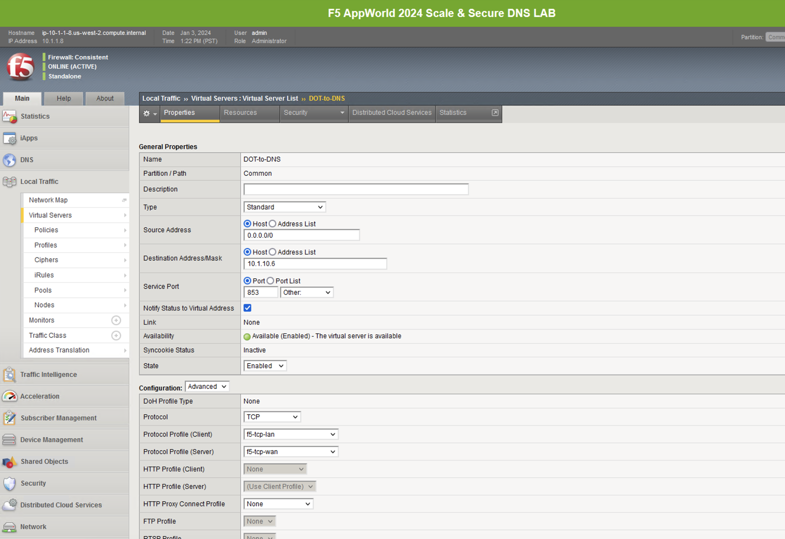

Test Driving DNS over TLS to Traditional DNS
^^^^^^^^^^^^^^^^^^^^^^^^^^^^^^^^^^^^^^^^^^^^

Minimize Firefox to view the desktop shortcuts and launch the Lab “Attack Host” Server session. You’ll be automatically logged in. Let’s run a DNS over TLS query: ::
   kdig +tls @10.1.10.6 www.f5.com

You should see a response similar to the output below. Run a few more queries against other domains to generate statistics.

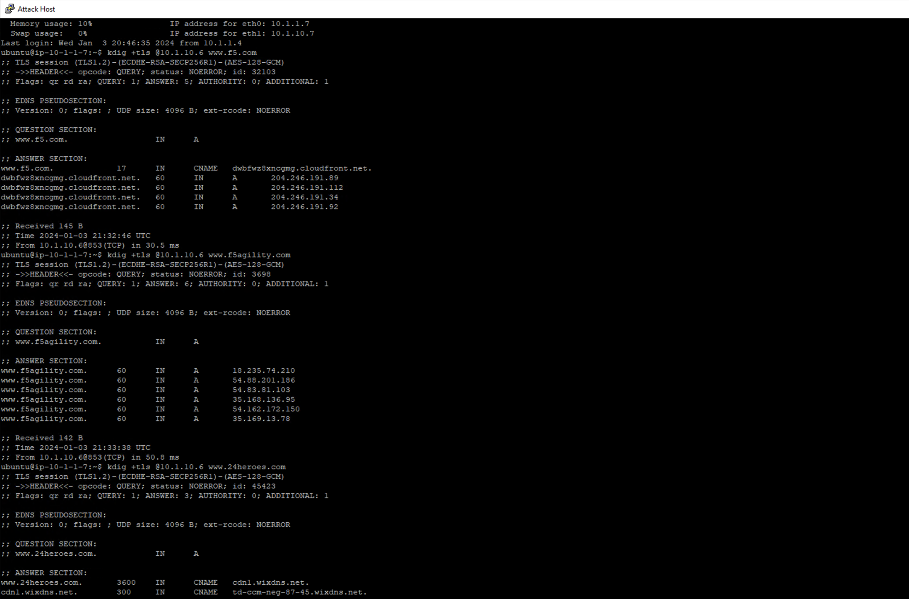

Viewing Statistics for DoT-to-DNS
^^^^^^^^^^^^^^^^^^^^^^^^^^^^^^^^^

You can then see statistics on the virtual server by navigating to **Statistics -> Module Statistics -> Local Traffic** and selecting *Virtual Servers* in the drop-down list.

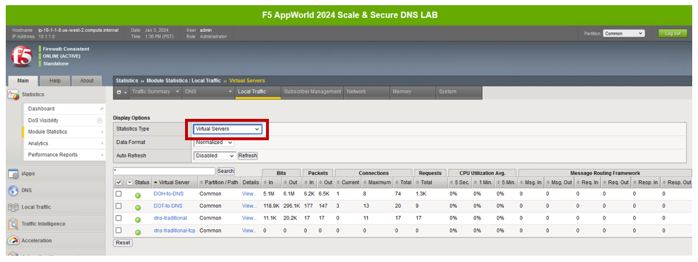

Because this virtual server takes advantage of backend pools, you will see statistics under the *Pools* statistics type as well.

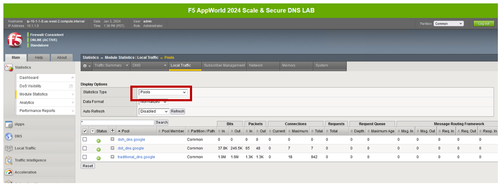

Because we don’t have any type of logging configured for that virtual server, you won’t see any information in **System -> Logs** for this traffic. If you’d want to log in your environment, general LTM F5 logging/statistics practices can be used.

Minimize Firefox and return to the BIG-IP DNS Proxy session from the first section of this lab or open a new session by clicking on the BIG-IP DNS Proxy icon on the desktop. Execute the follow tcpdump command: ::
   tcpdump -nni 0.0 port 53 or port 853

Pull the Lab DNS Server session window up and re-run the **kdig** command. Observe the front and back-end connections using port 853 and 53, respectively, shown in the packet capture output.

.. image:: _images/DOT-to-DNS-tcpdump.png
   :width: 7.5in
   :height: 4.6875in

Stop your capture before moving on to the next section. This concludes the DoT-to-DNS part of the lab.

Additional Resources
~~~~~~~~~~~~~~~~~~~~

The following resources will allow you to explore DoH and DoT more, and setup this functionality in your own environment.

- RFC8484: DNS over HTTPS: https://tools.ietf.org/html/rfc8484
- RFC7858: DNS over TLS: https://tools.ietf.org/html/rfc7858
- F5 TMSH reference for DoH-PROXY listener: https://clouddocs.f5.com/cli/tmsh-reference/latest/modules/gtm/gtm_listener-doh-proxy.html
- F5 TMSH reference for DoH-SERVER profile: https://clouddocs.f5.com/cli/tmsh-reference/latest/modules/ltm/ltm_profile_doh-server.html
- F5 Knowledge base article K05451012: Overview of the BIG-IP DNS Queries over HTTPS feature: https://my.f5.com/manage/s/article/K05451012  
