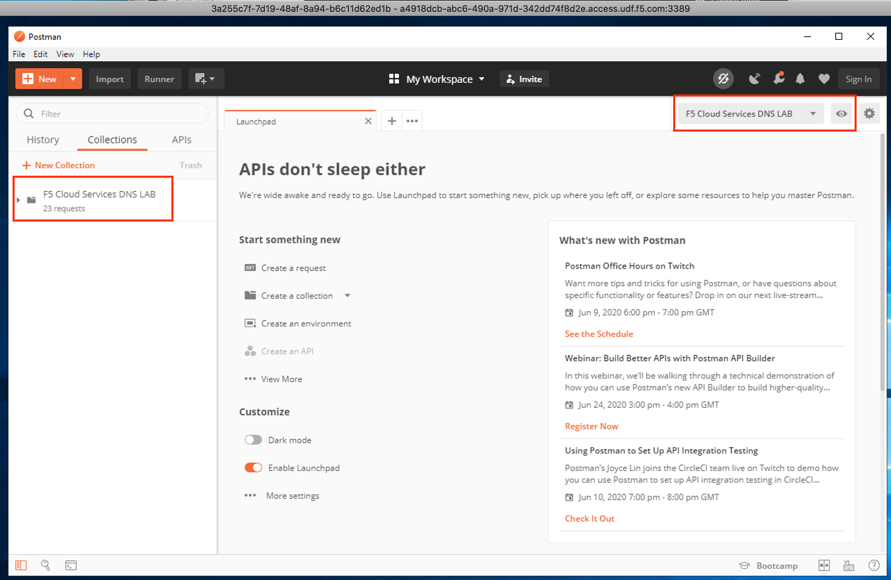

Lab Environment Setup / Validation
==================================

F5 Cloud Services Portal
------------------------

a. Login

   In order to use F5 Cloud Services, you need to be logged in with a valid user account. If you already have an account, please `Log In <https://portal.cloudservices.f5.com/>`_, or if you need to sign up for a new account, proceed to the `F5 Cloud Services sign up <http://bit.ly/f5csreg>`_

   .. figure:: ../_figures/1.png 

   Once you've logged in with an account, you will be using the user name and password values in the lab to authenticate with the F5 Cloud Services and the API.

#. Subscribe to Catalogs  

In order to access specific F5 Cloud Services, you need to subscribe to the corresponding service catalogs.

#. Click on the **Your F5 Cloud** tab in the left navigation panel and you will see the available service catalogs, as well as the services you have subscribed to, if any. For this lab you will need to click **Try it free** for both the **DNS** and the **DNS Load Balancer** services.

   .. figure:: ../_figures/2.png 

#. For the purposes of the lab you can utilize the Trial or the Free Tier for either one of the services. 
   
   .. note:: you will be asked to add your payment card even for the free tier, however you will not be charged if you follow the Free Tier guidelines outlined here:

   - `F5 DNS Cloud Service Pricing <https://clouddocs.f5.com/cloud-services/latest/f5-cloud-services-DNS-Pricing.html>`_
   - `F5 DNS Load Balancer Service Pricing <https://clouddocs.f5.com/cloud-services/latest/f5-cloud-services-GSLB-Pricing.html>`_

   Should you decide to add additional zones or LBR records beyond the Free Tier, you will only pay for what you use.

   You may also choose to not use a credit card, and instead subscribe through **AWS Marketplace**.

   - `AWS Marketplace: F5 DNS Cloud Service <https://aws.amazon.com/marketplace/pp/B07NKSRQ99>`_
   - `AWS Marketplace: F5 DNS Load Balancer Service <https://aws.amazon.com/marketplace/pp/B07W3P8HM4>`_
   
   .. figure:: ../_figures/33.jpg 
      
   Add payment card to pay by credit card:
      
   .. figure:: ../_figures/200.jpg 
         
   Or initiate the subscription from AWS Marketplace to subscribe through it:
         
   .. figure:: ../_figures/202.jpg 

   After successfully subscribing, your services will appear in the **Your F5 Cloud** tab. You will also see their current status.  

   .. figure:: ../_figures/4.png 

   If you need to check your payment information, it is available in the **Accounts** tab, **Payment** section.  

   .. figure:: ../_figures/5.png 

Postman Configuration
---------------------

**UDF**: If you're using the Unified Demo Environment (UDF) course, you already have Postman and the relevant collections & environment settings (outlined in red below) already configured for you in your personalized Windows VM. You may skip the rest of this section & move on to the Opera browser configuration.

If you're not using UDF, you can follow these steps for a new Postman installation:

a. `Download Postman here <http://bit.ly/309wSLl>`_, open it, create a Postman account if you don’t have one and choose to do so, and sign in.

b. Import collection and environment JSON files from the `Git repo for this lab <https://github.com/f5devcentral/f5-agility-labs-dns/tree/master/docs/class6/postman>`_:

    – collection: **https://bit.ly/3cKitde**

    – environment: **https://bit.ly/2A6D8ew**

   .. figure:: ../_figures/121.png
   .. figure:: ../_figures/121_1.png
   .. figure:: ../_figures/121_2.png
   .. figure:: ../_figures/121_3.png

   You will now see the imported collection (left side) with the calls that you will be utilizing grouped into several categories, as well as the environment variables (top right) used to store and pass data between Postman and the API.     

   .. figure:: ../_figures/2.jpg 

   You are now ready to interface with the F5 Cloud Services using Postman. 

Opera Browser with VPN to Test Geo Services 
-------------------------------------------

In order to test geo-proximity rules, you can use your own VPN service (if you have one), remote desktop to a VM in a different region (if you have one), or alternatively use the Opera browser (installed in your **UDF Course**), which is approach covered in this lab.

Open the Opera browser, click **Settings**,  **Advanced**, **Features** and then **Enable VPN**.   

.. figure:: ../_figures/7.png 

Zone Name 
---------

In order to create secondary DNS zone in the F5 Cloud Services portal, you need to have a zone name. Use Postman and follow the steps below to get the Zone name from the Lab service API.    

a. Open the “F5 Cloud Services DNS LAB” environment variables by clicking the “Environment Quick Look”, click into the field of the corresponding variable, and type the value of user email in the variable “USER_EMAIL” (click **Enter** after typing the values). 

   .. figure:: ../_figures/72.png 

   Repeat the same for the “USER_PASSWORD”. 

#. Select the **Login** request in the sidebar to login to your F5 Cloud Services profile and click **Send** to get the authorization token. More detailed information on this `API request can be found here <http://bit.ly/36ffsyy>`_.

   .. figure:: ../_figures/73.png 

   A successful login will result in Postman returning the tokens from the API, shown in the response body below: 

   .. figure:: ../_figures/84.jpg 

   These tokens are then stored for subsequent calls using a function inside Postman to set environment variables. You can see the test function in the **Tests** tab: 

   .. figure:: ../_figures/9.jpg 

   .. note:: If any of the subsequent Postman calls return a blank response or **"status": "unauthorized"** response (see the screenshot below), it means your user token has expired and you will need to re-login. To do that you just need to re-send the **Login** request. 

   .. figure:: ../_figures/10.jpg 

#. OPTIONAL: Set User ID & Account Info

   .. important:: If you originally signed up for F5 Cloud Services through a Limited User invitation (such as an email invite from another lab or from a different account owner), then it is possible that you haven't yet completed a full registration. You can quickly tell if you have by looking at your account(s) in the `F5 Cloud Services Portal <https://portal.cloudservices.f5.com/>`_ If you do now see any "Accounts you own:" and only see "Accounts you've been granted access to" as a **"Limited User"**, then you need to create a full account & update user info before you can proceed with this lab.

   You can do this by running the following **Set User Info** API call, after you've updated the Body of the request with your own organization & address information:

   .. figure:: ../_figures/118.jpg

   The response returns the following detail, including your own organization account ID (id):

   .. figure:: ../_figures/119.jpg

   `More information on this API request can be found here <https://portal.cloudservices.f5.com/docs#operation/CreateAccount>`_

   At this point you should be a full user with an "Owned Account" and a primary organization account id, which can also be confirmed in the `F5 Cloud Services Portal <https://portal.cloudservices.f5.com/>`_ in the drop-down under your user name (top right), where you should see "Accounts you own:" and the Organization Account you created with **"Owner"** defined.

#. Retrieve User ID & Account ID 

   Select the **Get Current User** request and click **Send** to retrieve User ID and Account ID to be used in the further requests. 

   .. figure:: ../_figures/86.jpg 

   The response returns the following detail: 

   .. figure:: ../_figures/12.jpg 

   The retrieved User ID and Account ID are then stored for subsequent calls. 

   .. figure:: ../_figures/11.jpg 

   `More detailed information on this API request can be found here <http://bit.ly/37hyQw3>`_

#. Let’s now retrieve DNS Zone Name with the **Get DNS Zone (lab)** API call. Click **Send**. This call will pass your “ACCESS_TOKEN” in the header of the request to the Labs API in order to validate existence of your F5 account & return back a Zone name unique to your lab. 

   Request: 

   .. figure:: ../_figures/74.png 

   The response will return your test DNS zone name and the status. 

   .. figure:: ../_figures/27.jpg 

   Sending this request will automatically capture of the Zone variables: 

   .. figure:: ../_figures/26.jpg 

   This Zone Name will be used for creating Secondary DNS Zone in the F5 Cloud Services portal, as well as throughout the lab as the domain name for your test applications. 
